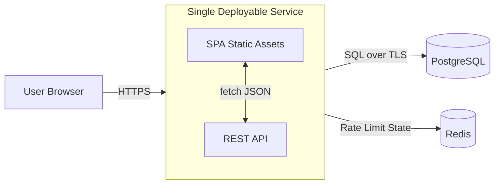
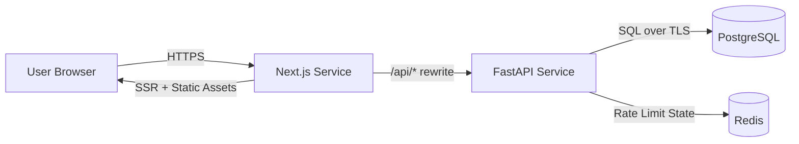

# 1. Title / Version / Status

**Project:** BetterMan
**Spec Version:** v0.6.0
**Status:** v0.6.4 shipped (v0.6.3 shipped, v0.6.2 shipped, v0.6.1 shipped, v0.6.0 shipped, v0.5.0 shipped, v0.4.0 shipped, v0.3.0 shipped, v0.2.1 shipped, v0.2.0 shipped, v0.1.2 shipped, v0.1.1 shipped, v0.1.0 shipped)
**Last Updated:** 2026-02-24 (EST)
**Interview Status:** Complete - v0.6.0 scoped

---

# 2. Executive Summary

-   BetterMan is a fast, modern web interface for Linux man pages focused on readability, speed, and navigation.
-   Anonymous, public, internet-facing web app (no accounts, no login) with stable shareable URLs.
-   Multi-distribution support (v0.3.0): presents man pages from multiple Linux distributions (Debian, Ubuntu, Fedora) with Debian as the canonical default. Users can view distribution-specific variations when they exist.
-   Provides high-quality rendering (headings, anchors, options tables, examples) versus raw terminal `man`.
-   Includes instant-feel search backed by a server-side index (PostgreSQL Full Text Search) with typo tolerance.
-   Keyboard-first UX: command palette (Cmd/Ctrl+K), global shortcuts, and consistent focus management.
-   Related commands discovery from "SEE ALSO" and cross-references.
-   Safe rendering: no arbitrary HTML injection; XSS-resistant content pipeline.
-   Production-ready v0.1.0 includes observability, rate limiting, backups, and a minimal deploy topology.

**Done (v0.1.0) means:** users can reliably search and read man pages with fast load times, stable links, accessible UI, and production-grade security/ops.

**v0.1.2 focus:** content coverage + compatibility:

-   Greatly expanded dataset (thousands of man pages; includes Debian's `manpages` / `manpages-dev`).
-   Extended man sections in URLs/API (e.g. `1ssl`, `3p`) for man7/die.net-style coverage.
-   Cleaner, calmer home page and deduped section labeling in "Browse".

**v0.2.0 focus:** quality, testing, performance, and developer experience:

-   Comprehensive testing infrastructure (Vitest, Playwright, axe-core)
-   Type-safe API contracts via OpenAPI + TypeScript generation
-   Performance optimizations (virtualization for large pages, bundle optimization)
-   Enhanced security (CSP nonces, Pydantic strict mode)
-   UX polish (Find-in-page improvements, print styles, TOC scroll-spy)
-   Component architecture improvements (decomposition, domain hooks)

**v0.2.1 focus:** polish, CSP refinement, and operational documentation:

-   CSP policy adjustment: `style-src` now includes `'unsafe-inline'` (required for TanStack Virtual positioning)
-   Visual polish: theme transition animations, mobile layout fixes, typography/contrast refinements
-   Performance tuning: query analysis, cache TTL optimization, bundle review
-   Operational runbooks: CSP debugging, Railway operations, E2E test debugging, type generation issues

**v0.3.0 focus:** performance, discoverability, and multi-distribution content expansion:

-   **Phase 1 (Performance):** Comprehensive profiling audit (Lighthouse, Chrome DevTools, React Profiler, Railway metrics); fix LCP issues and virtualization jank on large pages. Performance work blocks subsequent phases.
-   **Phase 2 (SEO Foundation):** Sitemap index (per-distribution XML files), meta tags via react-helmet-async (hybrid: static base + client-side enhancement), TechArticle JSON-LD (minimal fields).
-   **Phase 3 (Multi-Distribution):** Add Ubuntu and Fedora alongside Debian via parallel ingestion pipelines; distribution selector (global setting + per-page override); query param URL scheme (`?distro=ubuntu`).

**v0.4.0 focus:** hardening, observability, and discoverability:

-   **Security & Reliability:** Fix IP spoofing in rate limiter via CIDR-based proxy trust, add session rollback on errors, improve error handling for malformed search queries, paginate sitemaps for scalability.
-   **Observability:** Sentry integration (frontend + backend) for error tracking, Plausible integration for privacy-friendly analytics.
-   **Ingestion Improvements:** Per-page savepoints for partial failure recovery, structured logging with progress/ETA reporting.
-   **User Features:** Improved 404 suggestions via trigram similarity ("Did you mean..."), shareable deep links to options, keyboard shortcuts panel.

**v0.5.0 focus:** Next.js migration, content expansion, UX engagement, and mobile/PWA:

-   **Phase 1 (Next.js Migration):** Migrate frontend from Vite + TanStack Router to Next.js App Router for SSR/streaming. Two-service Railway deployment (Next.js + FastAPI). Server-rendered metadata replaces react-helmet-async.
-   **Phase 2 (Content Expansion):** Add Arch Linux, Alpine Linux, FreeBSD, and macOS (BSD-licensed pages only) — expanding from 3 to 7 distributions.
-   **Phase 3 (UX Engagement):** Bookmarks/favorites, enhanced history, reading preferences — all localStorage-based, no backend changes.
-   **Phase 4 (Mobile & PWA):** Service worker for offline reading, mobile bottom navigation, touch gestures, add-to-homescreen.
-   **Phase 5 (Infra & Polish):** Staging/prod full isolation, horizontal scaling readiness, documentation and release.


**v0.6.0 focus:** Complete design and UI/UX overhaul — hacker-tool aesthetic:

-   **Design system:** New typography (Geist Sans + JetBrains Mono), OLED-black dark mode, flat surfaces with crisp borders, tight 4–6px radii, red accent refinement, subtle dot-grid background.

---

# 3. Goals

## Product Goals

-   Make man pages easier to read and navigate than terminal output.
-   Make finding commands and flags fast (search-first).
-   Make links shareable and stable across time.

## Engineering Goals (Performance / Reliability)

-   P95 API latency for search under 250 ms at steady state.
-   P95 man page fetch/render under 200 ms API-side (excluding network).
-   Frontend LCP target under 2.5 s on "Fast 3G / mid-tier mobile" for cached shell + first page view under 3.0 s.
-   Zero XSS vulnerabilities from man content rendering.
-   High availability for a single-region v0.1.0 deployment (99.9% monthly).

## Engineering Goals (v0.2.0 Additions)

-   **Test Coverage:** Frontend unit tests with Vitest, E2E with Playwright, accessibility with axe-core.
-   **Type Safety:** Zero runtime type errors from API mismatches via OpenAPI-generated types.
-   **Bundle Size:** Initial JS bundle (home route) <= 250 KB gz with CI visibility.
-   **Virtualization:** Large pages (100+ blocks) render smoothly without jank.

## Operational Goals

-   Reproducible ingestion: any published dataset can be rebuilt from recorded inputs (container image digests + package manifests + parser version).
-   A single deployable service for web+API, plus managed PostgreSQL. Dataset releases promote staging → prod (staging/prod isolation is the target posture; early setups may temporarily share a DB).
-   Simple incident response with clear runbooks and metrics/alerts.

---

# 4. Non-Goals

-   No user accounts, authentication, profiles, favorites, or history in v0.1.0.
-   No SSR solely for crawlers. **v0.3.0 update:** Minimal SEO support added (sitemap, meta tags, JSON-LD) without SSR. **v0.5.0 update:** SSR is now in-scope via Next.js App Router migration — provides server-rendered content for SEO, OG tags, and improved initial load performance.
-   No user-generated content (comments, edits, annotations).
-   No offline native apps (desktop/mobile).
-   No full "terminal emulation" or interactive command execution.
-   No guarantee of 100% perfect fidelity to every troff macro edge case; prioritize readability with high fidelity for common pages.
-   No support for non-English locales in v0.1.0 (see content scope).
-   No enterprise features (SAML, private datasets).
-   No multi-distribution support in v0.1.0 (deferred to future versions).

---

# 5. Target Users & Primary Use Cases

## Personas

1. **CLI Learner:** learning Linux commands; needs clearer examples and quick lookup.
2. **Working Engineer/SRE:** frequently checks flags and "SYNOPSIS"; needs speed and keyboard navigation.
3. **Educator/Writer:** wants shareable links to authoritative docs.
4. **Power User:** prefers command palette, deep links to sections, and cross-references.

## Primary User Flows

1. Open BetterMan and search for a command (`tar`) from the homepage search.
2. Open a man page directly via URL `/man/tar/1`.
3. Use Cmd/Ctrl+K to open command palette and jump to `ssh_config(5)`.
4. Navigate by man section (1, 5, 8) and browse commands alphabetically.
5. Jump within a page using a generated table of contents (TOC) and anchored headings.
6. Click an option/flag in an "OPTIONS" table to highlight occurrences in the text (optional enhancement; see Open Questions).
7. Click cross-references in "SEE ALSO" to open related pages.
8. Copy a stable link to a specific section anchor (`#options`) and share it.
9. Use keyboard to scroll, jump to next/previous section, and go back.
10. Search for a flag or phrase within a page ("Find in page" integrated or browser-native).
11. Handle missing page: show nearest matches and suggestions.
12. View examples with syntax highlighting and copy-to-clipboard for code blocks.
13. Use mobile: search, read, and navigate with a sticky header and readable typography.
14. **Print a man page** with clean, navigation-free layout (v0.2.0).

---

# 6. User Experience (UX) Requirements

## Information Architecture (IA) / Page Layout

**Global layout**

-   Top app bar:
    -   Brand ("BetterMan") links to home.
    -   Primary search input (expands on focus) and command palette hint (`Ctrl+K`).
    -   Theme toggle (light/dark/system).
-   Main content area:
    -   **Home:** search focus + quick section navigation (no popular commands list - search-first approach).
    -   **Search results:** list with name, section, short description, and match highlights. Show 20 results initially with "Load more" button.
    -   **Man page view:** title header, synopsis, metadata (source package if known), TOC, content, related section.
    -   **Disambiguation page:** When URL like `/man/printf` matches multiple sections, show a full interstitial page listing all matching sections with descriptions for user selection.

**Man page view structure**

-   Header: `name(section)` + one-line description.
-   Left sidebar (desktop) or collapsible drawer (mobile):
    -   TOC (headings).
        -   **Desktop behavior:** TOC is sticky (follows scroll and stays visible). If the TOC is longer than the viewport, it scrolls independently.
        -   **Scroll-spy (v0.2.0):** Use IntersectionObserver API for accurate active heading detection, performant even on large pages.
    -   Find-in-page: sticky by default; user can hide/show it.
        -   **Match navigation (v0.2.0):** Show "3 of 15 matches" indicator with Enter (next) and Shift+Enter (previous) keyboard navigation.
    -   Quick nav: "SYNOPSIS", "DESCRIPTION", "OPTIONS", "EXAMPLES", "SEE ALSO" when available.
-   Main article:
    -   Rendered content with clear typographic hierarchy.
    -   Inline cross-references become links.
    -   Code/examples in preformatted blocks with copy button.

## Navigation Model

-   **Client-side routing** with stable, shareable URLs (no SSR requirement).
-   Back button behavior must be correct for:
    -   search → page → related page → back.
-   **History behavior:** Full history preserved. Home → Search → Page → Related requires 3 back presses to return home.
-   **Scroll restoration:** Top on navigate to new page; restore previous scroll position on back navigation.

## Command Palette (Cmd/Ctrl+K)

**Behavior**

-   Opens a modal overlay with:
    -   Input field (auto-focused).
    -   Result list (keyboard navigable).
-   Default mode: global search across man pages.
-   Supports actions:
    -   "Go to man page…"
    -   "Go to section…"
    -   "Toggle theme"
-   Query prefixes:
    -   `>` for actions only (optional in v0.1.0; if omitted, actions appear as top suggestions)
    -   `#` to jump to heading anchors in current page (only when in page view)
-   **Escape sequences:** Use `\>` or `\#` to search literally for these characters.
-   **Recent history:** On palette open (before user types), show last 5-10 visited pages and recent searches for quick access. History persisted in localStorage with option to clear.

## Keyboard Navigation Requirements (global)

-   App must be fully usable with keyboard only.
-   Visible focus indicator must always be present.
-   Focus order must be logical (header → sidebar → content).

### Shortcut List (v0.1.0)

**Conflict handling:** Shortcuts only activate when no input/textarea is focused. This prevents conflicts with browser defaults and accessibility tools.

-   **Cmd/Ctrl+K:** Open command palette
-   **Esc:** Close palette / close drawers / dismiss dialogs
-   **/** (slash): Focus search input (when not typing in an input/textarea)
-   **g then h:** Go home (optional; can be omitted if too complex)
-   **g then s:** Go to search results (optional)
-   **Alt+Left:** Back (browser default; ensure no conflicts)
-   **j / k:** Move selection down/up in result lists and TOC (within focused list)
-   **Enter:** Activate selected item
-   **[ / ]:** Previous/next man section in TOC (optional; only if deterministic)
-   **t:** Scroll to top
-   **b:** Toggle sidebar (desktop) / open TOC drawer (mobile)
-   **d:** Toggle theme (light/dark/system cycle)

### Find-in-page Shortcuts (v0.2.0)

-   **Enter:** Jump to next match (when find input focused)
-   **Shift+Enter:** Jump to previous match (when find input focused)

If optional shortcuts are not implemented, they must not be documented in UI.

## Dark Mode + Responsive Rules

-   Theme modes: Light, Dark, System.
-   **Default:** System preference (respects `prefers-color-scheme` media query on first visit).
-   Persist user choice in local storage after explicit selection.
-   Contrast ratios must meet WCAG 2.2 AA.
-   **Theme transition (v0.2.1):** 150ms CSS transition on background and text colors when switching themes. Respects `prefers-reduced-motion` (instant switch when reduced motion preferred).
-   **UI themes (v0.6.4, experimental):**
    -   Three visual modes: `default` (current hacker-tool system), `retro` (cyberpunk/matrix), `glass` (glassmorphic minimal).
    -   Selection is persisted via cookie (`bm-ui-theme`) and applied server-side on `<html data-bm-ui-theme="...">` for SSR-safe initial paint.
    -   Theme overrides are CSS-only and strictly scoped under `html[data-bm-ui-theme="retro"]` and `html[data-bm-ui-theme="glass"]`.
    -   UI themes are orthogonal to light/dark/system mode. `data-theme` remains the source of truth for color-scheme mode and continues to work in all UI themes.
-   Responsive:
    -   < 768px: sidebar becomes a drawer; header remains sticky and always visible (no hide-on-scroll); content uses larger line-height.
        -   **Mobile TOC access:** Sticky header button toggles TOC drawer. Button is always visible for quick access during reading.
    -   768–1024px: compact sidebar; TOC collapsible.
    -   > 1024px: persistent sidebar (sticky TOC) and wide reading column with max line width (target 70–90 chars).

## Print Styles (v0.2.0)

**Decision:** CSS print styles only - zero runtime cost.

When `@media print` is active:
-   **Hide all navigation:** Header, TOC sidebar, command palette, theme toggle, find-in-page - show only man page content.
-   **Code blocks:** Preserve with monospace font, use `page-break-inside: avoid` to keep blocks intact.
-   **Syntax highlighting:** Removed for print - plain monospace saves ink, better on B&W printers.
-   **Typography:** Optimized for paper - appropriate margins, readable font sizes.

## Visual Polish (v0.2.1)

**Decision:** Targeted refinements to address specific issues; not a design overhaul.

Typography adjustments:
-   **Code blocks:** Review monospace font size, line height, and padding for readability
-   **Body text:** Verify paragraph sizing and line length constraints
-   **Headings:** Confirm H1-H6 hierarchy and spacing consistency
-   **Small text:** Improve readability of labels, metadata, and captions

Color refinements:
-   **Dark mode contrast:** Ensure all elements meet WCAG AA contrast ratios
-   **Light mode contrast:** Address any washed-out muted elements
-   **Accent consistency:** Unify primary/accent color usage across components
-   **Syntax highlighting:** Adjust code highlighting colors for both themes

Mobile layout fixes:
-   **Header overflow:** Fix metadata tags wrapping/overflow on narrow screens
-   **TOC drawer:** Review sizing, positioning, and dismissal behavior
-   **Content width:** Ensure text and code blocks have proper padding

## Accessibility Requirements

-   Target **WCAG 2.2 AA**.
-   Focus management:
    -   Command palette traps focus while open; returns focus to trigger element on close.
    -   Route changes set focus to the primary heading (`h1`) for screen readers (without breaking scroll). This ensures screen reader users hear the page title immediately upon navigation.
-   Reduced motion:
    -   Respect `prefers-reduced-motion`; disable non-essential animations.
-   Semantic structure:
    -   Use proper heading levels and landmarks in the rendered document model.
-   Keyboard:
    -   No keyboard traps outside modals.
-   Color:
    -   Do not rely solely on color to convey meaning (e.g., highlighting matches).

## Empty / Loading / Error States

-   **Loading:** Basic structure skeleton only (title bar, TOC placeholder, content area placeholder). Fast to render, avoid detailed mockups.
-   **Empty search:** show tips and example queries.
-   **No results:** suggest spelling fixes.
    -   **Trigram suggestions (v0.2.0):** Show top 3 trigram-similar command names when FTS returns few results.
-   **Missing page:** show:
    -   "Page not found"
    -   Suggested alternative sections (if name exists in another section)
    -   Link to search results for the name
-   **Rollback URL handling:** If a URL points to a page that existed in a newer dataset but not after rollback, show "This page is temporarily unavailable" with context that it may return in a future update.
-   **Error recovery (React error boundary):** When a component crashes, show:
    -   "Something went wrong" message
    -   "Retry this page" button
    -   "Go to Home" button
    -   Do not auto-retry; let user choose action.

## URL Scheme and Shareable Links

**Stable URL structure (required)**

-   Man page: `/man/{name}/{section}`
    -   Examples: `/man/tar/1`, `/man/openssl/1ssl`, `/man/printf/3p`
-   Man page without section (allowed only when unambiguous):
    -   `/man/{name}`
    -   If ambiguous, redirect to a chooser page listing sections.
-   Section browse: `/section/{section}`
-   Search: `/search?q=...`
-   Anchor links:
    -   Use `#` fragments for headings/blocks, e.g. `/man/tar/1#options`

**Canonicalization rules**

-   **Case insensitivity:** Accept any case in URLs (e.g., `/man/TAR/1` serves same as `/man/tar/1`). Normalize to lowercase internally for storage and lookup.
-   Preserve display case in UI based on original man page data.

---

# 7. Core Features (v0.1.0)

## 7.1 Man Page Viewing

### Description

Render man pages into a readable, navigable web document with stable anchors, TOC, and improved typography.

### User Story

As a user, I want to open `man tar` in a browser and quickly understand usage and options without scanning raw terminal formatting.

### Functional Requirements

-   Fetch and display a man page by `(name, section, locale=en)`.
-   Show:
    -   Title `name(section)` and one-line description.
    -   TOC generated from headings.
    -   Anchored headings and internal deep links.
    -   Monospace blocks for examples and preformatted text.
-   Cross-references:
    -   Convert `foo(1)` style references to links if present in dataset.
    -   **Unresolved references:** Show as visually distinct disabled/gray text (not clickable) indicating the referenced page isn't available in the dataset.
-   **Raw source:** Do not provide "View source (roff)" toggle. Only rendered content is shown. This avoids licensing redistribution concerns.

### Edge Cases

-   Page exists in multiple sections (e.g., `printf(1)` and `printf(3)`).
-   Page name includes special characters (`systemd.unit`, `git-commit`).
-   Page contains uncommon roff macros or broken formatting.
-   "NAME" section missing or malformed.
-   **Very large pages (e.g., `bash(1)`):**
    -   v0.1.x: Render everything upfront with optimized React components.
    -   **v0.2.0:** Use TanStack Virtual for pages with 100+ content blocks. Virtualize content rendering for smooth scrolling.
-   **Long TOC headings (50+ characters):** Truncate at ~40 characters with ellipsis (`...`); show full text on hover/focus.
-   **ASCII art/diagrams:** Preserve in code blocks without syntax highlighting to maintain alignment.

### Virtualization Details (v0.2.0)

**Decision:** Use TanStack Virtual for large page rendering.

-   **Threshold:** Pages with 100+ content blocks are virtualized; smaller pages render fully.
-   **Anchor links in virtualized content:** URL `#anchor` scrolls to approximate position, then renders target section and fine-tunes scroll to exact heading.
-   **Library:** `@tanstack/react-virtual` - aligns with existing TanStack ecosystem (Router, Query).

### Acceptance Criteria

-   Given a valid URL for a supported page, the UI renders within performance budgets and includes a TOC when headings exist.
-   Headings are linkable via stable anchors and do not change between deploys unless content changes.
-   No raw HTML from man content is injected into the DOM unsanitized (see Section 10).

---

## 7.2 Search (Fast, Relevant)

### Description

Provide fast server-side search across man pages with good ranking for command names, descriptions, and relevant content matches.

### User Story

As an engineer, I want to type "chmod recursive" and immediately find the most relevant pages and sections.

### Functional Requirements

-   Search endpoint supports:
    -   Query string `q`
    -   Optional: `section` filter, `limit`, `offset`
-   Result includes:
    -   `name`, `section`, short description (from NAME)
    -   Highlight snippets (plain text) for matches
-   Query features:
    -   Prefix matching for command names (`tar` matches `tar`, `tarfile` if present)
    -   Typo tolerance (e.g., "chrmod" suggests `chmod`)
    -   Flag search (`--recursive`) treated as general text search (no special OPTIONS handling)
-   Search must be usable from:
    -   global header search
    -   command palette
    -   dedicated search page with filters
-   **Debouncing:** 150ms debounce on search input. Short delay feels instant while preventing per-keystroke API requests.
-   **Custom in-page search:** Provide custom search with highlights (not just browser Ctrl+F). Minimum 2 characters required before searching. Highlights matches and allows jump-between.
-   **Trigram suggestions (v0.2.0):** When FTS returns few/no results, display top 3 trigram-similar command names as "Did you mean..." suggestions.

### Edge Cases

-   Empty query or whitespace.
-   Very long query (abuse).
-   Non-ASCII characters (should not crash; may return no results).
-   Query matches too many documents.

### Acceptance Criteria

-   P95 search API latency under 250 ms with warm DB cache at target load (see Section 16).
-   Top 5 results for exact command name queries include that command first (e.g., `ls` returns `ls(1)` as #1).
-   Typo queries return helpful suggestions or corrected top results.

---

## 7.3 Navigation by Section/Category

### Description

Enable browsing man pages by section (1–9, plus any supported extras) and alphabetical index.

### User Story

As a learner, I want to browse all section 1 "User Commands" and discover commands I didn't know.

### Functional Requirements

-   Section landing page shows:
    -   Section title (e.g., "1: User Commands")
    -   **Alphabetical groups with letter headers:** Group entries under A-Z headers with sticky letters for easy scanning. Enables users to quickly jump to specific letter range.
    -   Search-within-section
-   Provide consistent section labels:
    -   Use standard man section mapping for display names.
-   Support deep link to section pages.

### Edge Cases

-   Extra sections (`7`, `n`, `l`, etc.).
-   Pages with non-letter starting characters.
-   Empty section (should be unlikely but must handle).

### Acceptance Criteria

-   Users can navigate from home → section → page without using search.
-   Section listing loads under performance budgets and is paginated if needed.

---

## 7.4 Related Commands

### Description

Show related commands derived from "SEE ALSO" and cross-reference signals.

### User Story

As a user reading `curl(1)`, I want to quickly jump to related tools and configuration docs.

### Functional Requirements

-   Display a "Related" panel on man page view:
    -   Primary: parsed "SEE ALSO" references that resolve to known pages.
    -   Secondary: same-prefix heuristics (e.g., `git-*` pages) limited to avoid noise.
-   Each related item shows `name(section)` + one-line description when available.
-   Related list is deterministic for a given dataset release.
-   **Collapsible full list:** Show 5 related items by default; expandable to show all. Provides balance between clean UI and complete information.

### Edge Cases

-   "SEE ALSO" references pages not in dataset (different package set).
-   References without sections.
-   References to external URLs in content.

### Acceptance Criteria

-   When "SEE ALSO" exists and contains resolvable references, at least those appear in Related.
-   Related links never produce broken navigation; if missing, they route to a missing-page UX with suggestions.

---

## 7.5 Command Palette

### Description

A keyboard-first omnibox to search, jump, and toggle app actions.

### User Story

As a power user, I want to press Ctrl+K and open `systemd.service(5)` without touching the mouse.

### Functional Requirements

-   Opens with Cmd/Ctrl+K.
-   Displays:
    -   search results (man pages)
    -   action results (theme toggle)
-   Keyboard navigation: Up/Down, Enter to open, Esc to close.
-   Remembers last used mode (optional).

### Edge Cases

-   Palette opened on slow network: show loading state and cached recent results.
-   Query returns no results: show helpful suggestions.

### Acceptance Criteria

-   Palette opens in < 50 ms UI response (no network required to open).
-   Palette is fully accessible (focus trap, ARIA labeling via React components; no raw HTML).

---

## 7.6 Syntax Highlighting for Examples

### Description

Improve readability of examples and configuration snippets via syntax highlighting and copy support.

### User Story

As a user, I want to copy a `bash` example from a man page and understand it quickly.

### Functional Requirements

-   **Highlight all code blocks:** Apply shell-like syntax highlighting to all preformatted blocks by default. Accept some false positives on config/data blocks for consistency. ASCII art/diagrams preserved in monospace without highlighting.
-   **Language optimization (v0.2.0):** Import only common languages (bash, shell, python, c, makefile) - covers 90%+ of man page examples while minimizing bundle size.
-   Highlighting must be performed safely without executing any embedded content.
-   Provide "Copy" button per code block:
    -   Copies plain text exactly as displayed (without line numbers).
    -   **Copy feedback:** Button icon changes from copy to checkmark for 2 seconds, then reverts. No text or toast notification; minimal visual feedback.

### Edge Cases

-   Blocks with mixed content and wrapped lines.
-   Very large blocks.
-   Non-UTF8 characters (should be normalized during ingestion).

### Acceptance Criteria

-   At least shell-like examples are highlighted in v0.1.0.
-   Copy always works and produces expected content.

---

## 7.7 Keyboard Navigation Everywhere

### Description

Consistent keyboard interactions across search, TOC, related links, and page content.

### User Story

As a keyboard-only user, I want to navigate search results and TOC without losing context.

### Functional Requirements

-   Search results list:
    -   Arrow keys or j/k to move selection
    -   Enter to open
    -   Esc to return focus to search input
-   TOC:
    -   Keyboard navigable list with Enter to jump
-   Page:
    -   "t" scroll to top
    -   Focus outlines visible
-   Ensure no focus loss on route changes.

### Edge Cases

-   Screen reader virtual cursor interactions with long documents.
-   Modals/drawers stacking (palette + TOC drawer): must define priority and Esc behavior.

### Acceptance Criteria

-   Full "search → open result → use TOC → open related → back" flow is possible without mouse.
-   Meets WCAG 2.2 AA keyboard criteria.

---

## 7.8 Option Highlighting (Interactive)

### Description

Click an option/flag in an "OPTIONS" section to highlight all occurrences of that option throughout the page content.

### User Story

As a user reading a complex man page, I want to click on `-r` in the OPTIONS table and see all mentions of `-r` highlighted throughout the page.

### Functional Requirements

-   When viewing a man page with an OPTIONS section:
    -   Each option/flag in the OPTIONS section is clickable.
    -   Clicking highlights all occurrences of that option in the page content.
    -   Clicking again or clicking a different option clears previous highlights.
-   Highlighting uses visual distinction (background color) but does not rely solely on color (also uses underline or border for accessibility).
-   Works in conjunction with custom in-page search (search can highlight different things).

### Edge Cases

-   Options with multiple aliases (e.g., `-r, --recursive`): highlight all aliases.
-   Options that appear in examples, warnings, or other sections.
-   Very common options that appear many times (may need "N occurrences found" indicator).

### Acceptance Criteria

-   Clicking an option highlights its occurrences across the page.
-   Highlights are accessible (not color-only).
-   Feature works without JavaScript errors on all tested man pages.

---

# 8. Content Scope

## Content Source Strategy

**v0.1.0–v0.2.x:** BetterMan was **distribution-agnostic**, presenting a single, unified set of man pages from Debian stable.

**v0.3.0 (Multi-Distribution):** BetterMan supports **multiple Linux distributions** with Debian as the canonical default.

**Supported Distributions:**
-   **Debian stable** (currently Debian 13 "trixie") — canonical reference, shown by default
-   **Ubuntu LTS** (currently Ubuntu 24.04 "Noble Numbat") — Debian-based, enterprise-common
-   **Fedora** (current stable release) — RPM-based, enterprise relevance

**Rationale:**
-   Debian remains the canonical default due to stability and comprehensive coverage.
-   Ubuntu adds enterprise coverage and Debian-derivative packages.
-   Fedora provides RPM ecosystem coverage and Red Hat-adjacent tooling.

**Distribution Selection:**
-   **Default:** Debian (current behavior preserved; existing URLs unaffected)
-   **URL scheme:** Query parameter `?distro=ubuntu` or `?distro=fedora` (preserves existing URLs)
-   **UI:** Global distribution preference (stored in localStorage) + per-page override when distribution variations exist
-   **Variations:** When a man page differs across distributions, a tab/dropdown selector appears

**Note:** Users visiting without a `?distro` parameter see Debian content by default. The distribution selector only appears when meaningful differences exist between distributions for a given page.

## Package Coverage

For v0.1.0, ingest man pages from:
-   Core system utilities (`coreutils`, `util-linux`, `findutils`, `grep`, `sed`, `awk`, etc.)
-   Networking tools (`curl`, `wget`, `ssh`, `rsync`, `netcat`, etc.)
-   System administration (`systemd`, `journalctl`, `mount`, `fdisk`, etc.)
-   Development tools (`git`, `make`, `gcc`, `gdb`, etc.)
-   Common servers and services (`nginx`, `apache2`, `postgresql`, `mysql`, etc.)
-   Text processing (`vim`, `less`, `cat`, `head`, `tail`, etc.)

**Target:** ~5,000–10,000 man pages covering the most commonly referenced commands and configuration files. (v0.1.2 is already in the ~4k–5k range and continues to expand.)

## Supported Sections

**Decision:** Support extended section strings matching `^[1-9][a-z0-9]*$` (e.g. `1`, `3p`, `1ssl`, `3ssl`).

-   Treat the first digit as the base section (1–9); preserve the suffix as part of the page identity.
-   Section browse and search filters accept extended sections (not digits-only).
-   UI section labels are derived from base section labels with known suffix mappings (e.g. `p` → POSIX, `ssl` → OpenSSL).

## Update Cadence

-   **Monthly** ingestion run (scheduled) to capture package updates.
-   **Emergency** out-of-band ingestion allowed (security/event-driven).
-   Each ingestion run produces a dataset version identifier:
    -   `dataset_release_id` (UTC timestamp + git SHA of ingestion pipeline + parser version).

## Locale / i18n Stance

-   v0.1.0 is **English-only**.
-   Ingestion uses locale `C.UTF-8` and extracts `en` man content only.
-   Non-English man pages are out of scope for v0.1.0 (see future roadmap).

---

# 9. Content & Data: Man Pages

## Source of Truth (Reproducible Acquisition)

-   Man content is extracted from the official Debian stable container image.
-   Ingestion records:
    -   Container image reference and resolved digest
    -   Installed package manifest (package name + version)
    -   Environment (locale, architecture)
    -   Ingestion toolchain versions (mandoc version, pipeline version)

## Licensing / Compliance Strategy

**Decision:** Maximum caution approach for licensing compliance.

-   Many man pages are under GPL, BSD, MIT, or other licenses depending on package.
-   v0.1.0 compliance approach:
    -   **Store full license text** for any page under GPL, LGPL, or similar copyleft licenses. Linking alone is insufficient for some licenses.
    -   Store and display **license metadata** per man page when obtainable (from package metadata and/or embedded license files).
    -   Provide an **Attribution / Licenses** page in the app:
        -   **Per-package grouping:** Group pages by source package; show license per package (e.g., 'tar' package is GPL-3.0).
        -   dataset release IDs
        -   packages included (manifest)
        -   Full license text for licenses that require it

**Assumption**

-   Redistribution of man pages is permitted under their licenses when proper notices and full text are provided where required.

## Canonical Identity for a Man Page

A man page is uniquely identified by:

-   `name` (string; e.g., `tar`)
-   `section` (string; e.g., `1`, `5`, `8`, `3p`)
-   `locale` (string; v0.1.0 fixed to `en`)
-   Optional: `package_name` and `package_version` (for attribution and provenance)

Canonical ID format (conceptual):

-   `{locale}:{name}({section})`

## Collision Handling

-   Same `name` across sections:
    -   Treated as distinct documents (must include `section` in canonical URL when ambiguous).
-   Multiple source files mapping to same `name(section)` (rare):
    -   Choose the one provided by the package with higher priority:
        1. base system packages
        2. non-base packages
    -   Record collision in ingestion report and mark as "resolved by priority".
    -   Keep the discarded candidates in an internal audit table (not user-facing) for debugging.

## Data Retention / Versioning Policy

-   Keep at least **6 monthly dataset releases** in production (rolling window) OR **180 days**, whichever is larger.
-   Keep:
    -   The current dataset release (active)
    -   The previous dataset release (rollback)
-   If storage becomes an issue, delete older full content blobs first while retaining metadata and release audit logs.

---

# 10. Parsing & Rendering Pipeline

## Recommended Parsing Approach and Rationale

**Decision:** Use `mandoc` as the primary renderer to convert roff man pages into a normalized intermediate representation.

-   Ingestion will run `mandoc` to produce a structured-enough output (HTML fragment) and then convert it into a **safe internal document model** (blocks/inlines) used by the UI.
-   Rationale:
    -   `mandoc` is widely used, robust for man/mdoc, and designed for safe rendering of roff.
    -   Producing a deterministic intermediate model allows stable anchors and consistent styling.

**Why this is necessary**

-   A reliable roff parser is non-trivial; delegating to a mature tool reduces correctness and security risk.

**Alternative**

-   `groff -Thtml` (higher variability, more complex output)
-   `man2html` (lower fidelity; more formatting edge cases)

## Ingestion Mechanism

1. Start from pinned Debian stable container image.
2. Install packages to expand man page coverage:
    - `man-db`
    - core `manpages` packages
    - common utilities packages
3. Enumerate man page source files (typically under `/usr/share/man`).
4. For each page:
    - Extract raw roff source (store hash; optionally store raw content if licensing permits)
    - Render using `mandoc` and capture output
    - Parse into internal document model
    - Extract metadata fields:
        - title, description (NAME), headings, options, examples, see also
        - plain text for search indexing
5. Validate (see below) and upsert into PostgreSQL.

## Validation and Failure Handling

-   Validation levels:
    -   **Hard fail** for:
        -   ingestion cannot record provenance (image digest, dataset release id)
        -   output cannot be sanitized into the safe internal model
    -   **Soft fail** for:
        -   parser cannot extract some structured fields (options table missing)
        -   unusual macro sections
    -   **Parse warnings (mandoc warnings):**
        -   **Flag but include:** If mandoc produces output with warnings, include the page but mark it in DB metadata with a `has_parse_warnings` flag.
        -   Optionally show subtle 'Formatting may be incomplete' indicator in UI for affected pages.
        -   Pages with warnings still count toward success rate for release validation.
-   Failures are recorded with:
    -   file path
    -   error category
    -   sample excerpt (truncated)
-   Release rule:
    -   If > 2% of pages hard-fail, ingestion fails and does not publish the update.
    -   **Partial success allowed:** If >80% of pages succeed (including those with warnings), publish the dataset. Alert about failures for investigation but don't block release.

## Output Schema (Internal Document Model)

**Decision:** Store parsed content as JSON (JSONB) representing a restricted set of nodes.

High-level schema (illustrative, not code):

-   Document:
    -   `title`: string
    -   `name`: string
    -   `section`: string
    -   `description`: string (one-line)
    -   `toc`: list of `{id, title, level}`
    -   `blocks`: array of block nodes

Block node types:

-   `heading`: `{id, level, text}`
-   `paragraph`: `{inlines: [...] }`
-   `list`: `{ordered: bool, items: [blocks...] }`
-   `definition_list`: `{items: [{termInlines, definitionBlocks}] }`
-   `code_block`: `{text, languageHint, id?}`
-   `table`: minimal support for options tables `{headers, rows}`
-   `horizontal_rule`
-   `note` / `warning` (optional mapping from common patterns)

Inline node types:

-   `text`: `{text}`
-   `code`: `{text}`
-   `emphasis`: `{inlines}`
-   `strong`: `{inlines}`
-   `link`: `{href, inlines, linkType: internal|external}`

Derived structured fields:

-   `synopsis`: array of code-like lines rendered as plain monospace (no special formatting/coloring).
-   `options`: **Preserve original structure** from man page without normalization. Do not attempt to merge `-a, --all` patterns or reformat. Store as extracted from source: `{flags, argument, description, anchorId}`
-   `examples`: list of `{code_block_id, caption?}`
-   `see_also`: list of `{name, section?, resolved_page_id?}`

## Rendering Rules (Model → UI)

-   `heading` → rendered heading with anchor link icon on hover/focus.
-   `definition_list` and `options`:
    -   Prefer rendering `options` in a table-like component for scannability.
-   `code_block`:
    -   Monospace, scrollable horizontally, copy button, syntax highlighting.
-   `link`:
    -   Internal: route to man page.
    -   **External:** Allow external links with indicator. Open in new tab with external link icon. User knows they're leaving BetterMan. Only allow `http` and `https` schemes; strip unsafe schemes.

## XSS-Safe Rendering Strategy (Explicit)

**Decision:** Never render man content via raw HTML insertion in the frontend.

-   All content is converted during ingestion into the restricted document model.
-   Frontend renders nodes using React components that escape text by default.
-   Links:
    -   Allow only `http` and `https` for external links.
    -   Strip/deny `javascript:`, `data:`, and other unsafe schemes.
-   No inline styles, no event handlers, no arbitrary attributes from source.
-   Any unexpected node types or malformed nodes are dropped with an ingestion warning.

## Quality Strategy: Fidelity vs Readability

-   Default priority: **readability** while preserving semantic structure.
-   Metrics:
    -   Parse success rate (% pages with non-empty title + blocks)
    -   Structured extraction rate (options extracted when "OPTIONS" exists)
    -   Anchor stability (hash of heading text mapping)
-   Testing:
    -   Golden tests on a curated set of representative pages (see Section 19).
    -   Visual regression (optional; keep minimal for v0.1.0).

---

# 11. Search & Ranking

## Architecture Decision (Server-side vs Client-side vs Hybrid)

**Decision:** Server-side search using PostgreSQL Full Text Search (FTS), with trigram similarity for typo tolerance.

**Why**

-   Avoids specialized infra (no Elasticsearch/OpenSearch).
-   Keeps dependencies minimal (PostgreSQL already required).
-   Scales well for the dataset size expected in v0.1.0.

**Alternative**

-   Client-side search with a downloaded index (large payload, slower on mobile, harder to update)
-   Dedicated search engine (better relevance at high scale but adds infra complexity)

## Indexing Technology

-   PostgreSQL:
    -   `tsvector` columns for:
        -   command name
        -   one-line description
        -   headings
        -   body text (normalized)
    -   `pg_trgm` index for fuzzy matching on names and short descriptions.

## Ranking Signals and Tie-breakers

Ranking score composed of:

1. **Exact match on `name`: Overwhelming 10x boost.** Exact name match always wins regardless of other relevance. Query `ls` = `ls(1)` first, always.
2. Prefix match on `name`
3. Match in `NAME` one-line description
4. Match in headings
5. Match in body text
6. Section preference (default order: 1, 8, 5, 7, 3, others; configurable)

Tie-breakers:

-   Shorter name first
-   Lower section number first (when numeric)
-   Stable deterministic ordering by `page_id`

## Query Features

-   Prefix: supported for name (`tar` matches `tar`, `tar-split` etc.).
-   Fuzzy:
    -   Use trigram similarity on name/description when FTS score is low.
    -   **Balanced threshold (0.3):** Standard pg_trgm default. Catches most typos with moderate noise. Not too aggressive, not too conservative.
-   Synonyms:
    -   v0.1.0: minimal. Do not maintain a large synonym dictionary.
    -   Optional: treat hyphen/underscore variants as equivalent during normalization.

## Performance Targets and Caching

-   Targets (API):
    -   Search: P50 < 80 ms, P95 < 250 ms (warm cache)
    -   Page fetch: P50 < 50 ms, P95 < 150 ms
-   Caching:
    -   HTTP caching for GET endpoints with `ETag` and `Cache-Control: public, max-age=300` for immutable dataset release pages.
    -   **Granular ETags (v0.2.0):** ETag based on `content_sha256 + dataset_release_id` - changes when content or dataset changes, maximizing cache hits.
    -   Longer cache for static assets (1 year with content hashes).
    -   **Redis on Railway** for rate limiting state (enables consistent rate limits across horizontal scaling). See Section 12 for architecture.

## Search Query Optimization (v0.2.0)

**Decision:** Focus on query plan analysis for the search ranking query.

-   Analyze `EXPLAIN ANALYZE` output for the complex search CTE
-   Ensure index-only scans where possible
-   Optimize CTE usage and join patterns
-   Target: maintain P95 < 250ms as dataset grows

## Performance Tuning (v0.2.1)

**Decision:** Comprehensive performance review based on production data.

Query analysis:
-   Run `EXPLAIN ANALYZE` on search ranking query with production-like data
-   Identify any sequential scans or inefficient joins
-   Document query plan and optimization opportunities

Cache tuning:
-   Review HTTP cache TTLs based on actual hit rates
-   Analyze Redis rate limiting memory usage and key expiration
-   Adjust `max-age` values if data shows opportunity for longer caching

Bundle analysis:
-   Review Vite bundle report for code splitting opportunities
-   Identify any unexpectedly large chunks
-   Ensure highlight.js lazy loading is effective
-   Target: maintain initial JS bundle <= 250 KB gz

## Performance Audit (v0.3.0)

**Decision:** Comprehensive profiling audit before any feature work. Performance blocks other v0.3.0 phases.

**Observed Issues:**
-   Initial page load (LCP) concerns — needs investigation
-   Virtualization jank on large pages (multiple pages affected) — scrolling feels stuttery

**Profiling Approach (Comprehensive):**

Frontend:
-   **Lighthouse:** Run against production URL for Core Web Vitals baseline
-   **Chrome DevTools Performance:** Record page load and scroll interactions
-   **React Profiler:** Component-level render analysis for virtualized pages

Backend:
-   **Railway Metrics:** Use built-in observability for API latency breakdown
-   **Database:** `EXPLAIN ANALYZE` on search and page fetch queries

**Targets:**
-   LCP < 2.5s on "Fast 3G / mid-tier mobile" (existing target, verify compliance)
-   Large page scroll: no dropped frames at 60fps during continuous scroll
-   Initial JS bundle: <= 250 KB gz (existing target, verify compliance)

**Blockers:** Performance issues must be resolved before proceeding to Phase 2 (SEO) and Phase 3 (Multi-Distribution).

**Fix Categories:**
-   **LCP fixes:** Font loading optimization, critical CSS, resource prioritization
-   **Virtualization fixes:** TanStack Virtual configuration tuning, overscan adjustments, memo optimization

## Abuse Controls (Rate limiting, Bot Mitigation)

-   Implement basic per-IP rate limiting at the application layer:
    -   Search endpoints stricter than page fetch.
    -   Example policy (tunable):
        -   `/search`: 60 requests/min per IP
        -   `/man/...`: 300 requests/min per IP
-   Block obviously abusive patterns:
    -   Reject extremely long queries (e.g., > 200 chars) with 400.
    -   Reject excessive offsets/limits.
-   Optional (recommended) front-door protection:
    -   Use the PaaS/DNS provider's basic DDoS protection; avoid introducing dedicated WAF configuration unless needed.

---

# 12. System Architecture

## High-level Architecture Diagram



**v0.5.0 deployment topology (two services):**



**Deployment Platform:** Railway for all services (web, PostgreSQL, Redis). v0.5.0 splits the single web service into Next.js (public-facing) and FastAPI (internal API via Railway private networking).

## Frontend Architecture

**Stack Decisions:**
-   **Runtime:** Node 25
-   **Build Tool:** Vite (**v0.5.0:** Next.js App Router replaces Vite)
-   **Framework:** React + TypeScript SPA (**v0.5.0:** Next.js with SSR + streaming + client hydration)
-   **Router:** TanStack Router (type-safe routing with excellent TypeScript integration) (**v0.5.0:** Next.js file-based App Router)
-   **State Management:** TanStack Query for server state + React Context for UI state (**v0.5.0:** RSC server fetch + TanStack Query dehydration for client)
-   **Meta Tags:** react-helmet-async (**v0.5.0:** Next.js `generateMetadata()` — server-rendered, zero client JS)
-   **Component Primitives:** Radix UI (selectively, e.g. Dialog) + small custom UI primitives
-   **CSS:** Tailwind v4
-   **Testing (v0.2.0):** Vitest + Testing Library for unit/component tests
-   **Virtualization (v0.2.0):** TanStack Virtual for large pages

-   Routing:
    -   Client-side router with routes mirroring URL scheme in Section 6
    -   404 fallback served to SPA for deep links
-   Data fetching:
    -   TanStack Query for all API requests with built-in caching, deduplication, and request cancellation on route changes.
-   Error boundaries:
    -   Global error boundary to render a "Something went wrong" page with Retry + Go Home options.
-   Caching:
    -   Browser HTTP cache + TanStack Query's in-memory cache for recently viewed pages.
-   Performance:
    -   Route-level code splitting.
    -   **v0.2.0:** TanStack Virtual for large documents (100+ blocks).
    -   Return everything from API; rely on gzip compression for large JSONB payloads.

## Component Architecture (v0.2.0)

**Decision:** Decompose large components and extract domain hooks.

### Component Decomposition

Split `ManPageView` into focused components:
-   `ManPageHeader` - Title, description, metadata
-   `ManPageTOC` - Table of contents with scroll-spy
-   `ManPageContent` - Main content rendering (virtualized for large pages)
-   `ManPageRelated` - Related commands panel

### Domain Hooks

Extract data fetching and state logic into reusable hooks:
-   `useManPage(name, section)` - Fetch and cache man page data
-   `useSearch(query, options)` - Search with debouncing and suggestions
-   `useTOC(headings)` - TOC state with scroll-spy via IntersectionObserver
-   `useFindInPage(content)` - Find-in-page state and match navigation

### Test Organization

**Decision:** Co-locate tests with components.

-   `ComponentName.test.tsx` next to `ComponentName.tsx`
-   Easy to find, clear ownership
-   Domain hooks tested independently

## Backend Architecture

**Stack Decisions:**
-   **Runtime:** Python 3.14
-   **Framework:** FastAPI
-   **Database Access:** SQLAlchemy 2.0 ORM (full ORM with type hints, async support)
-   **Migrations:** Alembic
-   **Testing:** pytest + httpx
-   **Validation (v0.2.0):** Pydantic v2 strict mode on all request models

-   Single FastAPI service providing:
    -   Read-only public REST endpoints
    -   Internal-only ingestion endpoints or DB-only ingestion (see Section 18)
-   Modules (conceptual):
    -   `api`: routing, request validation, error envelope
    -   `manpages`: retrieval, resolving references, related
    -   `search`: query parsing, ranking, suggestions
    -   `datasets`: metadata, release IDs
    -   `security`: rate limiting (Redis-backed), headers, CSP config
    -   `observability`: logging, metrics, tracing hooks

## Background Jobs / Workers

**Decision:** No always-on background workers in v0.1.0.

-   Ingestion and indexing run via scheduled GitHub Actions (Section 18), not an internal queue.
-   Rationale: reduces moving parts and operational complexity.
-   If later needed, add a minimal cron job runner in the same service.

## Static Asset / CDN Strategy

-   Serve SPA assets from the same service for v0.1.0 simplicity.
-   Enable CDN caching via the PaaS edge if available.
-   All assets must be fingerprinted (content-hash filenames) to allow long-term caching.

## Trade-offs and Debloat Rationale

-   Single service reduces operational overhead but couples API and frontend deploys.
-   PostgreSQL FTS avoids introducing search infrastructure.
-   Monthly ingestion avoids complex streaming updates.

### Libraries/Tools (minimal) with "Why necessary" + alternatives

-   **FastAPI**: Why necessary: fast, typed, production-ready API with minimal boilerplate. Alternative: Flask (less built-in validation) or no backend (client-only; rejected for search and dataset size).
-   **PostgreSQL**: Why necessary: durable storage + FTS + indexing in one system. Alternative: SQLite (insufficient for multi-user production and FTS scale).
-   **Redis**: Why necessary: rate limiting state that persists across horizontal scaling. Alternative: in-app rate limiting (doesn't scale) or DB-backed counters (adds latency).
-   **mandoc** (ingestion): Why necessary: robust man/mdoc renderer for roff inputs. Alternative: groff/man2html (less consistent).
-   **React + TypeScript**: Why necessary: component model + maintainability for complex rendering and keyboard UX. Alternative: Vue/Svelte (viable but not chosen per defaults).
-   **TanStack Query + Router**: Why necessary: type-safe routing and server state management with excellent caching. Alternative: React Router + SWR (viable but less TypeScript integration).
-   **TanStack Virtual (v0.2.0)**: Why necessary: efficient rendering of large man pages (bash has 6000+ lines). Alternative: react-window (less flexible for variable-height content).
-   **Radix UI**: Why necessary: accessible components with Radix primitives + Tailwind styling. Alternative: build from scratch (more work, a11y risk).
-   **highlight.js** (with limited languages): Why necessary: meet "syntax highlighting for examples" requirement. Alternative: Prism (similar trade-offs) or no highlighting (not acceptable).
-   **Vitest (v0.2.0)**: Why necessary: fast test runner that integrates with Vite build system. Alternative: Jest (slower, worse Vite integration).
-   **Playwright (v0.2.0)**: Why necessary: cross-browser E2E testing with excellent DX. Alternative: Cypress (Chrome-focused, slower parallel runs).
-   **Error reporting**: Railway logging only for v0.1.0 (no Sentry). Rely on structured logs and Railway's log aggregation.

## Rejected Stack Choices (Explicit)

-   **Elasticsearch/OpenSearch**: rejected due to extra infra, ops burden, and cost for v0.1.0; PostgreSQL FTS is sufficient.
-   **GraphQL**: rejected; REST endpoints are simpler, cache-friendly, and sufficient.
-   **Microservices**: rejected; unnecessary complexity at current scope.
-   **SSR/Next.js for SEO**: rejected; SEO indexing not required; CSR is simpler and faster to ship. (See SSR decision below.)
-   **Sentry**: rejected for v0.1.0; rely on Railway logging. May add later if debugging becomes challenging.
-   **Jest**: rejected for v0.2.0; Vitest integrates better with Vite build system.
-   **Cypress**: rejected for v0.2.0; Playwright offers better cross-browser support and faster parallel execution.

---

# 13. API Specification

## Protocol Style

**Decision:** REST + JSON over HTTPS.

Base path:

-   `/api/v1`

## OpenAPI Documentation (v0.2.0)

**Decision:** Auto-generated OpenAPI spec with examples.

-   FastAPI auto-generates OpenAPI spec from route decorators
-   Add response examples and descriptions in route decorators
-   Expose `/docs` (Swagger UI) and `/redoc` endpoints in staging/dev environments
-   Export OpenAPI JSON during CI for contract testing and type generation

## Type Generation (v0.2.0)

**Decision:** Generate TypeScript types from OpenAPI spec.

-   **Library:** `openapi-typescript` - lightweight, generates clean TypeScript types
-   **Timing:** Generate types during CI, fail if the generated output is out of date
-   **Outputs:**
    -   `frontend/src/api/openapi.gen.ts` — auto-generated (committed), do not edit manually
    -   `frontend/src/api/types.ts` — stable named aliases used by the app (thin wrapper around `openapi.gen.ts`)
-   **Benefit:** Zero runtime type errors from API mismatches

## Endpoint List (High-level)

### Dataset Metadata

-   `GET /api/v1/info`
    -   Returns current dataset release info.

Example response (shape):

```json
{
	"datasetReleaseId": "2026-01-01T00:00:00Z+abc123",
	"locale": "en",
	"pageCount": 8542,
	"lastUpdated": "2026-01-01T00:00:00Z"
}
```

### Fetch Man Page

-   `GET /api/v1/man/{name}`
    -   If unambiguous, returns that page; if ambiguous, returns 409 with options.
-   `GET /api/v1/man/{name}/{section}`

Response includes:

-   `page`: metadata
-   `content`: document model JSON
-   `related`: optionally embedded or separate endpoint

Example response (shape):

```json
{
	"page": {
		"id": "uuid-or-int",
		"locale": "en",
		"name": "tar",
		"section": "1",
		"title": "tar(1)",
		"description": "an archiving utility",
		"sourcePackage": "tar",
		"sourcePackageVersion": "x.y.z",
		"datasetReleaseId": "..."
	},
	"content": {
		"toc": [{ "id": "synopsis", "title": "SYNOPSIS", "level": 2 }],
		"blocks": [
			{
				"type": "heading",
				"id": "synopsis",
				"level": 2,
				"text": "SYNOPSIS"
			}
		]
	}
}
```

### Related

-   `GET /api/v1/man/{name}/{section}/related`

Example response (shape):

```json
{
	"items": [
		{
			"name": "gzip",
			"section": "1",
			"title": "gzip(1)",
			"description": "compress or expand files"
		}
	]
}
```

### Search

-   `GET /api/v1/search`
    Query params:
-   `q` (required)
-   `section` (optional)
-   `limit` (default 20, max 50)
-   `offset` (default 0, max 5000)

Example response (shape):

```json
{
	"query": "chmod recursive",
	"results": [
		{
			"name": "chmod",
			"section": "1",
			"title": "chmod(1)",
			"description": "change file mode bits",
			"highlights": ["... change the mode of each FILE to MODE ..."]
		}
	],
	"suggestions": ["chmod", "chown"]
}
```

### Section Browse

-   `GET /api/v1/sections`
    -   Returns supported sections with labels.
-   `GET /api/v1/section/{section}`
    -   Returns paginated listing.

## Pagination / Filtering / Sorting

-   Pagination: `limit` + `offset` for v0.1.0 simplicity.
-   Sorting:
    -   Search: relevance only.
    -   Section listing: alphabetical by `name`, stable tie-break by `section` and id.

## Standard Error Envelope

**Decision:** Minimal error detail (code + message only). No stack traces or internal details exposed.

All errors return:

```json
{
	"error": {
		"code": "string",
		"message": "string"
	}
}
```

No `details` object in production. Keep errors simple and user-friendly.

Examples:

-   404: `PAGE_NOT_FOUND`
-   409: `AMBIGUOUS_PAGE`
-   429: `RATE_LIMITED`

## Auth Stance (No Accounts)

-   Public endpoints are unauthenticated.
-   Internal ingestion endpoints (if exposed) must require a static bearer token or HMAC signature and be IP-restricted if possible.

## CORS, Rate Limits, Abuse Protection

-   CORS:
    -   Allow same-origin by default.
    -   If a separate domain hosts frontend, allow that specific origin only.
-   Rate limiting:
    -   Enforced on API endpoints (see Section 11).

## API Versioning Strategy

-   Prefix version in path: `/api/v1`.
-   Backwards-incompatible changes require `/api/v2` and parallel support for at least one release cycle (policy decision; v0.1.0 sets the precedent).

---

# 14. Database & Storage Design

## DB Strategy

**Decision:** PostgreSQL as the single durable datastore.

Justification:

-   Stores structured content (JSONB), metadata, and search vectors.
-   Enables fast search without extra systems.
-   Supports strong migrations and backups.

## Entities / Tables (High-level)

### `dataset_releases`

-   `id`
-   `dataset_release_id` (text)
-   `locale` (text, v0.1.0 always `en`)
-   `image_ref` (text)
-   `image_digest` (text)
-   `ingested_at` (timestamp)
-   `package_manifest` (JSONB, optional but recommended)
-   `is_active` (boolean) — marks the current active release
-   Index: unique (`dataset_release_id`)

### `man_pages`

Represents a canonical page identity within a dataset.

-   `id`
-   `dataset_release_id` (FK to dataset_releases)
-   `name` (text)
-   `section` (text)
-   `title` (text)
-   `description` (text)
-   `source_path` (text; original man file path)
-   `source_package` (text, nullable)
-   `source_package_version` (text, nullable)
-   `content_sha256` (text; hash of raw roff or normalized content)
-   Timestamps
-   Constraints: unique (`dataset_release_id`, `name`, `section`)

### `man_page_content`

-   `man_page_id` (PK/FK)
-   `doc` (JSONB) — internal document model
-   `plain_text` (text) — normalized text for search/snippets
-   `synopsis` (text or JSONB)
-   `options` (JSONB) — extracted list
-   `see_also` (JSONB) — extracted refs
-   Optional: `raw_roff` (bytea/text) if licensing allows (see Open Questions)

### `man_page_search`

Options:

-   either store search fields in `man_page_content` with generated columns
-   or a separate table for clarity

Recommended fields:

-   `man_page_id` (PK/FK)
-   `tsv` (tsvector)
-   `name_norm` (text)
-   `desc_norm` (text)

### `man_page_links`

Normalized resolved relationships (for related commands):

-   `from_page_id`
-   `to_page_id`
-   `link_type` (enum: `see_also`, `xref`)
-   Index: (`from_page_id`, `link_type`)

### `licenses`

-   `id`
-   `license_id` (SPDX id when known, else text)
-   `license_name`
-   `license_text` (optional)
-   `source_url` (optional)

### `man_page_license_map`

-   `man_page_id`
-   `license_id`
-   `attribution_text` (optional; includes required notices)

## Index Strategy

-   `man_pages`:
    -   btree on (`dataset_release_id`, `name`, `section`)
    -   btree on (`dataset_release_id`, `section`, `name`) for section browse
-   `man_page_search`:
    -   GIN index on `tsv`
    -   GIN or GIST trigram index on `name_norm` and `desc_norm` (requires `pg_trgm`)
-   `man_page_links`:
    -   btree on `from_page_id`
    -   btree on `to_page_id`

## Migration Strategy

-   Use a standard migration tool (e.g., Alembic) with:
    -   forward-only migrations
    -   migrations required for every schema change
-   Migrations applied automatically in staging; in prod, apply as part of deploy with rollback plan.

## Backup / Restore Requirements

-   Automated daily backups of PostgreSQL with 14-day retention minimum.
-   Point-in-time recovery (PITR) preferred if supported by PaaS.
-   Quarterly restore drill (staging restore from prod backup) documented.

---

# 15. Security, Privacy, and Compliance

## Threat Model Summary

-   **XSS:** malicious content embedded in man pages or external links.
-   **Injection:** SQL injection via search queries or parameters.
-   **SSRF:** if ingestion endpoints fetch URLs (avoid in v0.1.0).
-   **Supply chain:** compromised dependencies, compromised container images.
-   **Scraping/abuse:** high-volume requests, search endpoint abuse.
-   **Data integrity:** tampering with dataset releases.

## Mitigations

-   XSS:
    -   Safe document model rendering (no raw HTML injection).
    -   Strict URL sanitization for links.
    -   **CSP headers (v0.2.1 - Scripts Strict, Styles Relaxed):**
        -   `script-src 'self' 'nonce-{random}'` - no inline scripts without nonce
        -   `style-src 'self' 'unsafe-inline'` - inline styles allowed (required for TanStack Virtual positioning)
        -   `object-src 'none'`
        -   `upgrade-insecure-requests`
        -   Nonces generated per-request in FastAPI middleware, injected into HTML response and CSP header.
        -   **Note (v0.2.1):** `'unsafe-inline'` for styles is a pragmatic tradeoff - TanStack Virtual requires dynamic inline styles for virtualization positioning that cannot use nonces.
-   Injection:
    -   Parameterized queries only.
    -   **Pydantic strict mode (v0.2.0):** Enable strict validation on all API request models, reject invalid types.
    -   Strict input validation for `name`, `section`, `limit`, `offset`.
-   SSRF:
    -   In v0.1.0 ingestion runs offline in CI; backend does not fetch external content.
-   Supply chain:
    -   Pin key dependencies.
    -   Enable dependency scanning (Section 19).
    -   Ingestion records container digests; only use official images.
    -   **Quarterly dependency audit (v0.2.0):** Review security advisories, license compatibility, and bundle impact of major dependencies.
-   Abuse:
    -   Rate limiting (Section 11).
    -   Cache aggressively.
-   Integrity:
    -   Dataset release IDs and digests stored; ingestion requires signed CI secrets.

## CSP Nonce Implementation (v0.2.0, updated v0.2.1)

**Decision:** Generate nonces per-request in FastAPI middleware for scripts; allow inline styles.

Implementation:
1. Middleware generates cryptographically random nonce for each request
2. Nonce injected into HTML template served for SPA (script tags only)
3. Same nonce included in `Content-Security-Policy` header for `script-src`
4. `style-src` uses `'unsafe-inline'` instead of nonces

Benefits:
-   Scripts protected with per-request nonces (prevents XSS via script injection)
-   Styles allow inline for TanStack Virtual compatibility
-   Per-request nonces prevent script replay attacks

Tradeoffs (v0.2.1):
-   `'unsafe-inline'` for styles is less strict than nonce-only
-   However, XSS via style injection is lower risk than script injection
-   TanStack Virtual requires dynamic `style` attributes for positioning (`height`, `transform`) that cannot use nonces

Rollback:
-   Set `CSP_ENABLED=false` to disable CSP header injection (emergency only)

## Input Validation (v0.2.0)

**Decision:** Enable Pydantic v2 strict mode on all request models.

Scope:
-   All API request bodies
-   All query parameters
-   Path parameters validated via custom validators

Benefits:
-   Reject invalid types at API boundary
-   Stricter path/name validation prevents injection attempts
-   Clear error messages for malformed requests

## Rate Limit Resilience (v0.2.0)

**Decision:** In-memory fallback when Redis is unavailable.

Behavior:
-   Normal operation: Redis-backed rate limiting across all instances
-   Redis unavailable: Fall back to in-memory rate limiting per-process
-   Same rate limits apply (may allow 2x total if 2 instances running, acceptable tradeoff)
-   Log warning when falling back, alert if prolonged

Benefits:
-   Service remains protected even during Redis outages
-   No requests fail solely due to rate limit backend issues
-   Maintains security posture during degraded state

## Secrets Management

-   Store secrets in PaaS secret manager:
    -   DB URL
    -   error reporting DSN
    -   ingestion token (if used)
-   Rotate ingestion token quarterly.

## Privacy Stance

-   No accounts.
-   No collection of PII beyond standard server logs (IP addresses) required for security/operations.

## Logging Redaction and Retention

-   Do not log full query strings at info level; store hashed or truncated query for metrics.
-   Retention:
    -   Application logs: 14 days (minimum), with longer retention only if necessary for security.
    -   Error traces: 30 days.

## Dependency Auditing (v0.2.0)

**Decision:** Weekly Dependabot + quarterly manual audit.

Weekly (automated):
-   Dependabot PRs for all dependency types
-   CI runs security checks on updates

Quarterly (manual):
-   Review CVE advisories for all dependencies
-   Check license compatibility for new/updated deps
-   Analyze bundle size impact of major dependencies
-   Document findings in security review log

## License Compliance for Man Pages

-   Provide a `/licenses` UI route:
    -   Dataset release details
    -   package manifest
    -   license notices
-   Maintain an internal compliance checklist per dataset.

---

# 16. Reliability, Performance, and Scalability

## SLOs / SLIs

-   Availability: **99.9%** monthly for web and API.
-   Latency SLIs:
    -   `/api/v1/search`: P95 < 250 ms
    -   `/api/v1/man/...`: P95 < 150 ms
-   Error rate: < 0.5% 5xx over 5-minute windows (excluding deploy windows).
-   **Latency breach handling:** Alert on-call if P95 exceeds thresholds; investigate and fix manually. No automatic degradation or circuit breaker for v0.1.0.

## Performance Budgets

-   Frontend:
    -   Initial JS bundle (home route): <= 250 KB gz (target)
    -   **Bundle enforcement (v0.2.0):** CI comments on PR with size diff and percentage change; warns but does not block merge. Gives visibility without being too strict.
    -   Route-based code splitting for man page renderer and highlighting
-   Core Web Vitals (guidance; not SEO-driven but user experience):
    -   LCP < 2.5 s (repeat visits)
    -   INP reasonable (avoid heavy main-thread work on render)

## Performance Targets (v0.2.0)

New performance targets for v0.2.0 features:

-   **Virtualization overhead:** < 50ms additional render time for virtualized pages vs full render
-   **E2E test execution:** < 5 minutes for full critical flows suite
-   **Type generation:** < 30 seconds during CI build
-   **Bundle size increase:** < 20KB gz for v0.2.0 features (virtualization, testing utils excluded from prod)

## Caching Layers

-   Browser: ETag and max-age for stable content.
-   **Granular ETags (v0.2.0):** ETags based on `content_sha256 + dataset_release_id` for man pages - more cache hits when content unchanged across dataset updates.
-   CDN/Edge: cache GET responses where safe.
-   API: avoid in-memory caches that cause correctness issues; minimal memoization allowed.
-   DB: rely on Postgres caches; keep indexes optimized.

## Load Assumptions and Scaling Plan

Assumptions for v0.1.0:

-   50–200 concurrent users typical
-   Bursts: up to 1,000 requests/min during spikes

Scaling:

-   Vertical scaling first (bigger app instance, bigger Postgres).
-   Horizontal scaling for web service if needed (stateless).
-   Rate limiting in-app may need adjustment or front-door enforcement if multi-instance.

## Graceful Degradation

-   If search is slow/unavailable:
    -   show partial results or "search temporarily unavailable" with retry.
-   If page fetch fails:
    -   show cached page in client (if available) and allow retry.

---

# 17. Observability & Operations

## Metrics / Logs / Traces

-   Metrics (minimum):
    -   request count by route/status
    -   latency histograms by route
    -   rate limit rejections
    -   DB query latency (coarse)
-   Logs:
    -   structured logs with request id
    -   error logs include dataset identifiers when relevant
-   Tracing:
    -   Optional in v0.1.0; do not mandate full distributed tracing since single service. If enabled, use OpenTelemetry minimal setup.

## Dashboards (v0.1.0)

-   API Overview:
    -   RPS, error rate, P50/P95 latency for search and page endpoints
-   DB Health:
    -   connections, slow queries, CPU
-   Abuse:
    -   429 counts, top IPs (aggregated), search query rate

## Alerting Thresholds

-   Availability: 5xx > 2% for 10 minutes → page.
-   Latency: `/search` P95 > 500 ms for 10 minutes → page.
-   DB: connection saturation > 80% for 10 minutes → page.
-   Ingestion: scheduled ingestion fails twice consecutively → ticket.

## Runbooks (Top 5 Incidents)

1. **Search latency spike**
    - Check DB CPU/IO, active queries, index bloat
    - Reduce search limit temporarily via config
    - Enable stricter rate limiting
    - Investigate slow query plan; add/adjust indexes
2. **Man page fetch returning 500**
    - Inspect logs for content decode/parsing issue
    - Identify affected dataset release and page ids
    - Roll back to previous dataset release (if data corruption)
3. **DB connection exhaustion**
    - Check connection pool config
    - Scale DB instance or reduce pool size
    - Verify no connection leaks
4. **Abuse / scraping**
    - Increase rate limiting
    - Add temporary IP blocks
    - If available, enable PaaS-level throttling
5. **Bad ingestion release published**
    - Mark dataset release as inactive
    - Roll back to prior dataset release
    - Re-run ingestion with fix; verify failure thresholds before republishing

## Runbooks (v0.2.1 Additions)

Detailed step-by-step runbooks located in `docs/runbooks/`:

6. **CSP violations debugging** (`docs/runbooks/csp-violations.md`)
    - Check browser DevTools console for CSP violation reports
    - Identify source of violation (inline styles, scripts, third-party)
    - Verify nonce injection is working correctly
    - If emergency: set `CSP_ENABLED=false` in Railway env vars
    - For style violations from TanStack Virtual: expected (documented tradeoff)

7. **Railway operations** (`docs/runbooks/railway-ops.md`)
    - Deploy: automatic on push to `main` after CI passes
    - Manual deploy: `gh workflow run deploy.yml -f ref=<branch>`
    - View logs: Railway dashboard or `railway logs`
    - Restart service: Railway dashboard "Restart" button
    - Scale: adjust instance count in Railway settings
    - Environment variables: Railway dashboard "Variables" tab

8. **E2E test failures** (`docs/runbooks/e2e-debug.md`)
    - Check CI artifacts for Playwright traces and screenshots
    - Run locally: `pnpm frontend:e2e` (requires backend running)
    - Debug specific test: `pnpm frontend:e2e -- --debug -g "test name"`
    - Flaky test? Check for timing issues, add explicit waits
    - Update snapshots: `pnpm frontend:e2e -- --update-snapshots`

9. **Type generation out of sync** (`docs/runbooks/type-gen.md`)
    - CI fails with "generated types differ"
    - Run: `cd backend && uv run python -c "from app.main import app; import json; print(json.dumps(app.openapi()))" > ../frontend/src/api/openapi.json`
    - Run: `cd frontend && pnpm openapi:gen`
    - Commit the regenerated `openapi.gen.ts`
    - If Pydantic models changed, verify TypeScript types are correct

10. **Multi-distro operations** (`docs/runbooks/multi-distro-ops.md`)
    - Check `/api/v1/info` per distro (`?distro=ubuntu|fedora`)
    - Trigger monthly ingest + promotion (`update-dataset` workflow)
    - Verify per-distro sitemap endpoints are live (`/sitemap-<distro>.xml`)

---

# 18. CI/CD & Environments

## Environments

-   **dev:** local developer environment
    -   **Docker Compose primary:** PostgreSQL and Redis in containers; developers run app on host. Minimal host dependencies beyond Docker.
    -   Local Postgres + Redis via `docker-compose.yml`
-   **staging:** production-like deployment (ideally separate DB), used for validation
-   **prod:** public deployment

Staging and prod must be isolated:

-   separate DB instances
-   separate secrets
-   separate dataset releases (publish to staging first)

**Note:** `update-dataset` in GitHub Actions uses `BETTERMAN_STAGING_DATABASE_URL` and `BETTERMAN_PROD_DATABASE_URL`. Small deployments may temporarily point both at the same Postgres instance, but isolating staging/prod is strongly recommended.

## GitHub Actions Workflows (Responsibilities)

### `ci.yml` (lint/test/build)

-   Install dependencies
-   Run type checks and linting
-   Run unit + integration tests (backend: pytest, frontend: Vitest)
-   **Run E2E tests (v0.2.0):** Playwright critical flows
-   **Run accessibility tests (v0.2.0):** axe-core checks
-   Build frontend assets (production build)
-   Build backend (container build or artifact)
-   Dependency review for PRs (block vulnerable dependency additions)
-   **Bundle size reporting (v0.2.0):** Comment on PR with size diff
-   **API contract check (v0.2.0):** Export OpenAPI + run openapi-typescript; fail if generated types differ

### `codeql.yml` (code scanning)

-   CodeQL analysis for Python + JavaScript/TypeScript
-   Runs on PRs, pushes to `main`, and a weekly schedule

### `scorecards.yml` (security posture)

-   OSSF Scorecards (SARIF uploaded to GitHub code scanning)
-   Runs on pushes to `main` and a weekly schedule

### `dependabot.yml` (dependency updates)

-   Weekly dependency update PRs for:
    -   GitHub Actions workflows
    -   Frontend npm dependencies
    -   Backend + ingestion uv lockfiles
    -   Docker base images

### `deploy.yml` (deploy/promote/rollback)

-   Deploy to staging on merge to main
-   Run smoke tests against staging
-   Manual approval step to promote to prod
-   Rollback:
    -   redeploy previous artifact
    -   optionally flip dataset release pointer to previous release

### `update-docs.yml` (ingest/parse/validate/index/publish)

**Decision:** Staging first, auto-promote.

-   Scheduled monthly + manual dispatch
-   Ingestion steps:
    -   resolve container image digest
    -   extract man sources
    -   run mandoc conversion + model conversion
    -   validate success rate thresholds (>80% success required)
    -   **Always write to staging DB first**
-   Validation step:
    -   Run automated validation against staging
    -   Check parse success rates, search functionality, sample page renders
-   Publish step:
    -   **Auto-promote if checks pass:** Copy dataset release to prod DB automatically
    -   If validation fails, alert and do not promote
    -   Keep previous release for rollback

**Security note**

-   Use restricted DB role with rotate secrets for prod writes.
-   Staging verification provides safety gate before prod promotion.

## Branching / Releases / Tags / Rollback

-   Trunk-based development:
    -   `main` is always releasable
    -   short-lived feature branches
-   Release tags:
    -   `v0.1.0` tag upon launch
    -   `v0.2.0` tag for quality/testing milestone
-   Rollback:
    -   redeploy previous version
    -   dataset rollback supported by storing previous dataset release and a "current release" pointer

## Project Structure

**Decision:** Monorepo with pnpm workspaces.

```
/
├── frontend/           # React SPA
│   ├── src/
│   │   ├── api/
│   │   │   ├── openapi.gen.ts  # Auto-generated from OpenAPI (v0.2.0)
│   │   │   └── types.ts        # Stable aliases used by app
│   │   ├── components/
│   │   │   ├── ManPageView/
│   │   │   │   ├── ManPageView.tsx
│   │   │   │   ├── ManPageView.test.tsx  # Co-located test (v0.2.0)
│   │   │   │   ├── ManPageHeader.tsx
│   │   │   │   ├── ManPageTOC.tsx
│   │   │   │   ├── ManPageContent.tsx
│   │   │   │   └── ManPageRelated.tsx
│   │   │   └── ...
│   │   ├── hooks/
│   │   │   ├── useManPage.ts
│   │   │   ├── useSearch.ts
│   │   │   ├── useTOC.ts
│   │   │   └── useFindInPage.ts
│   │   └── ...
│   └── e2e/            # Playwright E2E tests (v0.2.0)
├── backend/            # FastAPI service
├── shared/             # Shared types/constants (if needed)
├── ingestion/          # Ingestion pipeline scripts
├── docker-compose.yml  # Local dev services
├── pnpm-workspace.yaml
└── package.json
```

-   Single repo enables easier cross-cutting changes
-   pnpm workspaces for dependency management
-   **TypeScript types generated from OpenAPI (v0.2.0)**

## Infrastructure-as-Code (Minimal stance)

-   v0.1.0: minimal IaC acceptable:
    -   Document environment variables and required resources
    -   Optionally include a simple Terraform template later; not required for launch

---

# 19. Testing Strategy

## Overview (v0.2.0 Enhancements)

Testing strategy significantly expanded for v0.2.0 with comprehensive frontend testing.

## Unit Tests

### Backend (existing)
-   Parsing/model conversion utilities (ingestion pipeline)
-   Search query normalization and ranking logic
-   Link resolution rules
-   **Framework:** pytest + httpx

### Frontend (v0.2.0)
-   **Framework:** Vitest + Testing Library
-   **Organization:** Co-located with components (`ComponentName.test.tsx` next to `ComponentName.tsx`)
-   **Scope:**
    -   Domain hooks (useManPage, useSearch, useTOC, useFindInPage)
    -   Utility functions (URL normalization, text processing)
    -   Component rendering and interactions
-   **Coverage targets:** Focus on business logic, not implementation details

## Integration Tests

-   API endpoints with a seeded Postgres dataset
-   Search correctness (name exact match, prefix, fuzzy)
-   Man page retrieval and ambiguity behavior

## E2E Tests (v0.2.0)

**Decision:** Playwright for critical flows only.

**Framework:** Playwright

**Scope:** 10-15 tests covering critical user flows:
-   Home → Search → Results → Page view
-   Command palette open → search → select result
-   TOC navigation and scroll-spy
-   Find-in-page functionality
-   Mobile responsive behavior
-   404 / missing page handling
-   Theme toggle persistence

**Configuration:**
-   Run in CI on every PR
-   Single browser (Chromium) for speed; cross-browser testing deferred
-   Parallel execution for faster CI

## Contract Tests

-   Frontend ↔ API schema compatibility:
    -   **OpenAPI type generation (v0.2.0):** Types generated from OpenAPI spec ensure compile-time compatibility
    -   ensure required fields exist and types are stable
    -   snapshot test JSON shapes

## Golden Tests (Parsing/Rendering Fidelity)

-   Curate a representative suite of pages:
    -   small/simple (e.g., `ls(1)`)
    -   large (`bash(1)`)
    -   mdoc-heavy (`ssh_config(5)`)
    -   options-heavy (`curl(1)`)
-   For each:
    -   compare extracted fields (title/description/TOC count)
    -   compare stable anchors
    -   compare rendered plaintext output snapshots

## Performance Tests

-   Search load test:
    -   ensure P95 < 250 ms at target concurrency
-   Page fetch test:
    -   ensure no N+1 queries for related links

## Accessibility Tests (v0.2.0)

**Decision:** axe-core in CI, fail on critical + serious violations.

**Implementation:**
-   Integrate axe-core with Playwright E2E tests
-   Run accessibility checks on key pages:
    -   Home page
    -   Search results
    -   Man page view (small and large)
    -   Command palette open state
-   **Failure threshold:** Critical and Serious violations fail CI; Minor issues logged as warnings
-   Manual keyboard-only testing checklist for each release (maintained separately)

## Security Testing Basics

-   Dependency scanning (SCA)
-   SAST for backend and frontend
-   CSP validation in staging
-   Fuzz testing on search query input normalization (lightweight)

---

# 20. Analytics & Feedback

**Decision (v0.1.0):** No client analytics. Server metrics only.

-   Zero client-side tracking, cookies, or JavaScript analytics.
-   Rely entirely on server-side metrics:
    -   Request counts by route/status (from Railway logs)
    -   Latency histograms by route
    -   Rate limit rejections
    -   Search query counts (without query text)
-   Simplest and most private approach.
-   May revisit in future versions if product insights are needed, but for v0.1.0 server metrics suffice.

---

# 20.5 SEO & Discoverability (v0.3.0)

**Decision:** Minimal SEO support without SSR.

## Sitemap

**Implementation:** Sitemap index with per-distribution XML files.

-   `/sitemap.xml` — sitemap index pointing to distribution-specific sitemaps
-   `/sitemap-debian.xml` — all Debian man page URLs
-   `/sitemap-ubuntu.xml` — all Ubuntu man page URLs
-   `/sitemap-fedora.xml` — all Fedora man page URLs

**Generation:** Regenerated after each dataset update (scheduled monthly ingestion).

**Size management:** Sitemap index pattern handles growth as distributions expand.

## Meta Tags

**Implementation:** Hybrid approach using react-helmet-async.

-   **Static base:** Basic meta tags in `index.html` (title, description, og:image)
-   **Client-side enhancement:** react-helmet-async updates page-specific meta on route change
-   **Per-page meta:**
    -   `<title>`: `{name}({section}) - BetterMan`
    -   `<meta name="description">`: One-line description from man page
    -   `<meta property="og:title">`: Same as title
    -   `<meta property="og:description">`: Same as description

**Note:** Search engines will see the static base; JavaScript-capable crawlers (Googlebot) will see enhanced meta.

## Structured Data (JSON-LD)

**Schema type:** TechArticle (Schema.org)

**Fields (minimal):**
```json
{
  "@context": "https://schema.org",
  "@type": "TechArticle",
  "headline": "tar(1) - GNU tar manual page",
  "name": "tar(1)",
  "description": "an archiving utility",
  "dateModified": "2026-01-01T00:00:00Z",
  "author": {
    "@type": "Organization",
    "name": "tar maintainers"
  }
}
```

**Injection:** Client-side via react-helmet-async `<script type="application/ld+json">`.

## robots.txt

**Policy:**
-   Allow all crawlers for man page content
-   Disallow `/api/` endpoints (API is for app use, not crawling)
-   Point to sitemap index

```
User-agent: *
Allow: /
Disallow: /api/
Sitemap: https://betterman.sh/sitemap.xml
```

---

# 21. Milestones & Delivery Plan

## Phased Plan (v0.1.0) - COMPLETED

1. **Week 1–2: Foundations**
    - Repo scaffold, CI, environments, basic API skeleton, DB schema v1
    - Basic SPA routing + layout + theme
2. **Week 3–4: Ingestion MVP**
    - Container-based extraction from Debian stable
    - Parse to internal document model
    - Render man pages end-to-end
3. **Week 5: Search MVP**
    - PostgreSQL FTS + ranking
    - Search UI + results page
4. **Week 6: Navigation + Related**
    - Section browse pages
    - SEE ALSO parsing + related panel
5. **Week 7: Polish + Accessibility + Performance**
    - Command palette with recent history
    - Syntax highlighting + copy
    - **Option highlighting (interactive)**
    - Custom in-page search with highlights
    - Keyboard nav and WCAG fixes
6. **Week 8: Production hardening**
    - Rate limiting, CSP, error reporting, dashboards, runbooks
    - Staging soak + load tests + rollback drills
    - Cut `v0.1.0` tag and launch

## Phased Plan (v0.2.0)

**Phase 1: Testing Infrastructure**
1. Set up Vitest with Testing Library
2. Add co-located tests for existing components
3. Extract and test domain hooks
4. Set up Playwright for E2E
5. Implement critical flow E2E tests
6. Add axe-core accessibility testing

**Phase 2: Type Safety & API**
1. Configure OpenAPI export in FastAPI
2. Set up openapi-typescript generation in CI
3. Update frontend to use generated types
4. Enable Pydantic strict mode on request models
5. Add response examples to API routes

**Phase 3: Security Hardening**
1. Implement CSP nonce generation in middleware
2. Update frontend to support nonce-based CSP
3. Add in-memory rate limit fallback
4. Configure quarterly dependency audit process

**Phase 4: Performance & UX**
1. Implement TanStack Virtual for large pages
2. Optimize highlight.js to common languages only
3. Add bundle size CI reporting
4. Implement granular ETags
5. Add Find-in-page match count and navigation
6. Implement TOC scroll-spy with IntersectionObserver
7. Add CSS print styles

**Phase 5: Component Architecture**
1. Decompose ManPageView into sub-components
2. Extract domain hooks
3. Add tests for new components/hooks

## Definition of Done (v0.1.0 Launch Checklist) - COMPLETED

**Code complete (repo)**

-   [x] Man pages ingested and visible in UI (via ingestion pipeline)
-   [x] Stable URLs and anchor links work and are shareable
-   [x] Option highlighting feature works across tested pages
-   [x] Custom in-page search with highlighting works
-   [x] No unsafe raw HTML injection for man content (see Section 10)
-   [x] CSP enabled
-   [x] Rate limiting enabled (Redis-backed)
-   [x] Incident runbooks written and reviewed
-   [x] Licenses/attribution page complete with license text for packages in dataset

**Staging/production verification (ops)**

-   [ ] Search meets latency targets and relevance acceptance criteria (load test)
-   [ ] CSP verified in staging
-   [ ] Backups enabled and restore validated
-   [ ] Monitoring dashboards and alerts configured (Railway logs)
-   [ ] Accessibility: WCAG 2.2 AA baseline checks pass; keyboard-only flows validated

## Definition of Done (v0.2.0 Launch Checklist)

**Testing Infrastructure**

-   [ ] Vitest configured with Testing Library
-   [ ] Domain hooks have unit tests
-   [ ] Key components have co-located tests
-   [ ] Playwright E2E tests for critical flows (10-15 tests)
-   [ ] axe-core accessibility tests integrated in CI
-   [ ] CI fails on critical/serious a11y violations

**Type Safety**

-   [ ] OpenAPI spec exported during CI
-   [ ] TypeScript types generated from OpenAPI
-   [ ] Frontend uses generated types for API calls
-   [ ] Pydantic strict mode enabled on all request models

**Security**

-   [ ] CSP nonces implemented (no 'unsafe-inline')
-   [ ] In-memory rate limit fallback working
-   [ ] Quarterly dependency audit process documented
-   [ ] First audit completed

**Performance**

-   [ ] TanStack Virtual working for large pages (bash, etc.)
-   [ ] highlight.js bundle optimized (common languages only)
-   [ ] Bundle size CI comments working
-   [ ] Granular ETags implemented

**UX Polish**

-   [ ] Find-in-page shows match count and position
-   [ ] Find-in-page supports Enter/Shift+Enter navigation
-   [ ] TOC scroll-spy uses IntersectionObserver
-   [ ] Print styles hide navigation, preserve content

**Component Architecture**

-   [ ] ManPageView decomposed into sub-components
-   [ ] Domain hooks extracted and tested
-   [ ] Tests co-located with components

## Phased Plan (v0.3.0)

**Phase 1: Performance Audit (Blocks Phase 2 & 3)**
1. Run comprehensive Lighthouse audit on production
2. Profile with Chrome DevTools Performance (page load + scroll)
3. Profile with React Profiler (virtualized page renders)
4. Review Railway metrics for API latency breakdown
5. Run `EXPLAIN ANALYZE` on search and page fetch queries
6. Document findings and prioritize fixes
7. Fix LCP issues (font loading, critical CSS, resource prioritization)
8. Fix virtualization jank (TanStack Virtual tuning, memo optimization)
9. Verify targets met: LCP < 2.5s, smooth scroll, bundle <= 250KB gz

**Phase 2: SEO Foundation**
1. Add react-helmet-async dependency
2. Implement page-specific meta tags (title, description, og:*)
3. Add TechArticle JSON-LD structured data
4. Create sitemap generation endpoint/script
5. Implement sitemap index with per-distribution XML files
6. Add robots.txt
7. E2E test: sitemap validation

**Phase 3: Multi-Distribution**
1. Assess database schema for multi-distribution support
2. Add `distribution` column/table as needed
3. Create parallel ingestion pipeline for Ubuntu
4. Create parallel ingestion pipeline for Fedora
5. Update API to accept `?distro=` query parameter
6. Implement distribution selector UI (global setting)
7. Implement per-page distribution selector (when variations exist)
8. E2E test: distribution selector workflow
9. Update runbooks for multi-distro operations

**Phase 4: Polish & Release**
1. Audit runbooks against production experience
2. Update documentation (SPEC, README, PLAN)
3. CI green on `main`
4. Deploy healthy
5. Tag `v0.3.0`

## Definition of Done (v0.3.0 Launch Checklist)

**Performance**

-   [x] Lighthouse audit completed and documented
-   [x] LCP < 2.5s on Fast 3G (verified)
-   [x] Virtualized page scroll: smooth at 60fps
-   [x] Initial JS bundle <= 250 KB gz (verified)
-   [x] All profiling findings addressed or documented for future

**SEO**

-   [x] react-helmet-async integrated
-   [x] Page-specific meta tags working (title, description, og:*)
-   [x] TechArticle JSON-LD on man pages
-   [x] Sitemap index at `/sitemap.xml`
-   [x] Per-distribution sitemaps generated
-   [x] robots.txt deployed

**Multi-Distribution**

-   [x] Database schema supports multiple distributions
-   [x] Ubuntu man pages ingested
-   [x] Fedora man pages ingested
-   [x] `?distro=` query parameter working
-   [x] Global distribution preference (localStorage)
-   [x] Per-page distribution selector (when variations exist)
-   [x] Parallel ingestion pipelines working

**Testing**

-   [x] E2E test: sitemap is valid XML with expected URLs
-   [x] E2E test: distribution selector switches content
-   [x] Existing E2E tests still pass

**Operations**

-   [x] Runbooks audited against production experience
-   [x] Multi-distro runbook added

---

# 22. Risks & Mitigations

1. **Licensing ambiguity for redistribution**
    - Mitigation: store package manifests + license metadata; provide attribution UI; legal review before launch; omit raw roff download if uncertain.
2. **Parsing fidelity issues / broken pages**
    - Mitigation: golden test suite; ingestion failure thresholds; allow fallback rendering as plain text for specific pages (feature-flagged).
3. **Search quality dissatisfaction**
    - Mitigation: boost exact name matches; add trigram fallback; collect anonymous "no results" counts (if analytics enabled).
4. **Abuse/scraping leading to cost spikes**
    - Mitigation: aggressive caching; rate limiting; optional upstream protection; cap limits/offsets.
5. **Dataset drift and reproducibility**
    - Mitigation: record container digests and manifests; version dataset releases; keep rollback releases.
6. **v0.2.0: Virtualization complexity**
    - Mitigation: Only virtualize pages with 100+ blocks; maintain non-virtualized path for smaller pages; thorough E2E testing of anchor links in virtualized content.
7. **v0.2.0: CSP nonce implementation breaks existing functionality**
    - Mitigation: Test thoroughly in staging; have rollback plan to previous CSP policy.
8. **v0.2.0: Type generation adds CI complexity**
    - Mitigation: Generate types during CI, fail fast on schema mismatches; document regeneration process.
9. **v0.3.0: Multi-distribution database complexity**
    - Mitigation: Assess schema carefully before implementation; choose cost-effective approach; maintain Debian as canonical default.
10. **v0.3.0: Parallel ingestion pipeline failures**
    - Mitigation: Independent pipelines per distribution; one distribution failure doesn't block others; clear alerting per pipeline.
11. **v0.3.0: SEO without SSR limitations**
    - Mitigation: Use react-helmet-async for client-side meta; modern Googlebot executes JavaScript; monitor Search Console for indexing issues.
12. **v0.3.0: Performance regression from multi-distro queries**
    - Mitigation: Ensure proper indexes on distribution column; maintain query performance targets; profile before and after.
13. **v0.5.0: Next.js migration scope creep**
    - Mitigation: Phase 1 is blocking; ship migration before adding features. Keep SPA deployable as rollback.
14. **v0.5.0: SSR hydration bugs (theme/distro/localStorage)**
    - Mitigation: `useEffect` for client-only state; render neutral defaults on server; thorough E2E testing.
15. **v0.5.0: Two-service Railway networking issues**
    - Mitigation: Test private networking thoroughly in staging; health checks for both services; rollback plan keeps SPA deployable.
16. **v0.5.0: FreeBSD VM extraction flakiness in CI**
    - Mitigation: Retry logic; monthly cadence; fallback to pre-extracted archive if VM fails.
17. **v0.5.0: macOS license filtering misses proprietary pages**
    - Mitigation: Curated allowlist approach; conservative initial set; label as "macOS (BSD)" in UI.
18. **v0.5.0: Alpine low man page coverage disappoints users**
    - Mitigation: Set expectations in UI ("Alpine has limited man page coverage"); require `-doc` subpackages.
19. **v0.5.0: PWA service worker caching stale content**
    - Mitigation: Versioned cache; cache-busting on deploy; "Update available" prompt for users.
20. **v0.5.0: Next.js bundle size regression**
    - Mitigation: Next.js bundle analyzer in CI; compare against Vite baseline; fail CI on significant regressions.

---

# 23. Open Questions (All Resolved)

All open questions have been resolved through the interview process:

1. **Licensing policy detail:** ✅ RESOLVED - Do not expose raw roff source. Only show rendered content to avoid redistribution concerns. Maximum caution approach with full license text stored.
2. **Ingestion write path:** ✅ RESOLVED - Staging first, auto-promote. Write to staging DB first, run automated validation, auto-promote to prod if checks pass.
3. **Analytics stance:** ✅ RESOLVED - No client analytics. Server metrics only via Railway logging. Zero client-side tracking.
4. **Option highlighting feature:** ✅ RESOLVED - Yes, implement in v0.1.0. Click option to highlight all occurrences throughout the page.
5. **Supported sections:** ✅ RESOLVED - Extended sections matching `^[1-9][a-z0-9]*$` (e.g. `3p`, `1ssl`).
6. **External link handling:** ✅ RESOLVED - Allow external links with indicator. Open in new tab with external link icon. User knows they're leaving.

## v0.2.0 Decisions (All Resolved)

7. **Frontend testing approach:** ✅ RESOLVED - Vitest + Testing Library for unit/component tests.
8. **E2E testing framework:** ✅ RESOLVED - Playwright for critical flows only (10-15 tests).
9. **Type generation:** ✅ RESOLVED - OpenAPI + openapi-typescript, generated during CI build.
10. **CSP hardening level:** ✅ RESOLVED - Strict with nonces, generated in FastAPI middleware.
11. **Large page rendering:** ✅ RESOLVED - TanStack Virtual for pages with 100+ blocks.
12. **Virtualization anchor handling:** ✅ RESOLVED - Scroll to approximate position, render target, fine-tune.
13. **Accessibility testing scope:** ✅ RESOLVED - axe-core in CI, fail on critical + serious violations.
14. **Print support level:** ✅ RESOLVED - CSS print styles only (zero runtime cost).
15. **Find-in-page enhancements:** ✅ RESOLVED - Match count + navigation with Enter/Shift+Enter.
16. **TOC scroll-spy implementation:** ✅ RESOLVED - IntersectionObserver API.
17. **Input validation scope:** ✅ RESOLVED - Pydantic strict mode on all request models.
18. **Bundle size enforcement:** ✅ RESOLVED - CI comments with soft warn, does not block merge.
19. **Rate limit fallback:** ✅ RESOLVED - In-memory fallback with same limits per-process.
20. **Dependency auditing:** ✅ RESOLVED - Weekly Dependabot + quarterly manual audit (security, license, size).
21. **Component decomposition:** ✅ RESOLVED - Split ManPageView into sections, extract domain hooks.
22. **highlight.js optimization:** ✅ RESOLVED - Common languages only (bash, shell, python, c, makefile).
23. **Test organization:** ✅ RESOLVED - Co-located with components.
24. **ETag granularity:** ✅ RESOLVED - Content SHA + dataset release ID.
25. **Search query optimization:** ✅ RESOLVED - Query plan analysis focus.
26. **OpenAPI documentation level:** ✅ RESOLVED - Auto-generated + examples.
27. **Hook extraction scope:** ✅ RESOLVED - Domain hooks (useManPage, useSearch, useTOC, useFindInPage).
28. **Print code block handling:** ✅ RESOLVED - Preserve with page-break-inside: avoid.
29. **A11y violation severity:** ✅ RESOLVED - Critical + serious fail CI, minor as warnings.
30. **Type generation timing:** ✅ RESOLVED - CI build step, commit to repo.
31. **Version target:** ✅ RESOLVED - v0.2.0 (new minor version).
32. **Migration approach:** ✅ RESOLVED - Phased approach documented.

---

# 24. Appendix

## Glossary

-   **Man page:** Unix manual page document, typically roff-based.
-   **roff/troff:** Typesetting language family used for man pages.
-   **mandoc:** A tool that parses and formats man/mdoc documents.
-   **Dataset release:** A versioned snapshot of ingested man content.
-   **FTS:** Full Text Search.
-   **TOC:** Table of Contents.
-   **CSP:** Content Security Policy.
-   **Nonce:** Number used once - cryptographic token for CSP.
-   **E2E:** End-to-end (testing).
-   **a11y:** Accessibility (numeronym).

## Referenced Schemas (High level)

-   Internal Document Model: Section 10 "Output Schema"
-   API Error Envelope: Section 13
-   Canonical identity: Section 9

## Keyboard Shortcuts Table (v0.1.0 + v0.2.0)

| Shortcut      | Context             | Action                        |
| ------------- | ------------------- | ----------------------------- |
| Cmd/Ctrl+K    | Global              | Open command palette          |
| Esc           | Global/Modal        | Close modal/drawer, dismiss   |
| /             | Global              | Focus search input            |
| j / k         | Lists (results/TOC) | Move selection down/up        |
| Enter         | Lists               | Activate selection            |
| Enter         | Find-in-page        | Jump to next match (v0.2.0)   |
| Shift+Enter   | Find-in-page        | Jump to previous match (v0.2.0) |
| t             | Page view           | Scroll to top                 |
| b             | Page view           | Toggle TOC sidebar/drawer     |
| d             | Global              | Toggle theme (cycle)          |
| Alt+Left      | Browser             | Back                          |

---

## Required Decisions Summary (for audit)

### Core Architecture
-   Search architecture: **Server-side** via PostgreSQL FTS + trigram (0.3 threshold).
-   Ingestion/update pipeline: **Monthly**, staging-first with auto-promote; >80% success allows partial publish.
-   Man page identity: **Name + Section + Locale**; collisions resolved by explicit section scoping.
-   Safe rendering: **Restricted document model**, no raw HTML injection; strict link sanitization.
-   Deployment topology: **Single service** (web+API) + **managed PostgreSQL** + **Redis** on Railway.
-   SSR usage: **No SSR** in v0.1.0; CSR SPA with stable URLs and server fallback routing.
-   Distribution approach: **Distribution-agnostic** for v0.1.0; single source (Debian stable) as implementation detail.

### Frontend Stack
-   Build: **Vite**
-   Framework: **React + TypeScript**
-   Router: **TanStack Router**
-   Data: **TanStack Query**
-   UI primitives: **Radix UI** (selectively, e.g. Dialog)
-   CSS: **Tailwind CSS v4**
-   Linting: **ESLint**
-   Testing (v0.2.0): **Vitest + Testing Library** (unit), **Playwright** (E2E), **axe-core** (a11y)
-   Virtualization (v0.2.0): **TanStack Virtual** (100+ blocks threshold)
-   Runtime: **Node 25**

### Backend Stack
-   Framework: **FastAPI**
-   ORM: **SQLAlchemy 2.0**
-   Migrations: **Alembic**
-   Testing: **pytest + httpx**
-   Validation (v0.2.0): **Pydantic v2 strict mode** on request models
-   Runtime: **Python 3.14**

### Key Feature Decisions
-   Option highlighting: **Yes, in v0.1.0**
-   Custom in-page search: **Yes, with highlights**
-   Find-in-page navigation (v0.2.0): **Match count + Enter/Shift+Enter**
-   Syntax highlighting: **All code blocks** (shell-like default)
-   highlight.js optimization (v0.2.0): **Common languages only** (bash, shell, python, c, makefile)
-   Raw source view: **No** (removed for licensing)
-   Analytics: **None** (server metrics only)
-   External links: **Allow with indicator**
-   Sections supported: **`^[1-9][a-z0-9]*$`** (e.g. `3p`, `1ssl`)
-   Print support (v0.2.0): **CSS print styles only**

### UX Decisions
-   Theme default: **System preference**
-   Mobile TOC: **Sticky header button**
-   Mobile header: **Always visible** (no hide-on-scroll)
-   Disambiguation: **Full interstitial page**
-   Related commands: **Collapsible** (5 default, expand for all)
-   Search results: **20 with load more**
-   Copy feedback: **Icon change** (checkmark)
-   TOC scroll-spy (v0.2.0): **IntersectionObserver**

### Security Decisions (v0.2.0)
-   CSP: **Strict with nonces**, generated in FastAPI middleware
-   Input validation: **Pydantic strict mode** on all request models
-   Rate limit fallback: **In-memory per-process**, same limits
-   Dependency auditing: **Weekly Dependabot + quarterly manual** (security, license, size)

### Testing Decisions (v0.2.0)
-   Frontend unit: **Vitest + Testing Library**, co-located tests
-   E2E: **Playwright**, critical flows only (10-15 tests)
-   Accessibility: **axe-core in CI**, fail on critical + serious
-   Type generation: **openapi-typescript**, CI build step

### Project Structure
-   Repository: **Monorepo** with pnpm workspaces
-   Local dev: **Docker Compose** for services
-   Type sharing (v0.2.0): **OpenAPI-generated TypeScript types**
-   Component architecture (v0.2.0): **Decomposed components + domain hooks**

---

# 25. Migration & Upgrade Path (v0.2.0)

## Overview

v0.2.0 is a **non-breaking** release focused on quality, testing, and developer experience. All changes are additive or internal improvements.

## Breaking Changes

**None.** v0.2.0 maintains full backwards compatibility with v0.1.x.

## Phased Implementation Order

Recommended order for implementing v0.2.0 changes:

### Phase 1: Testing Foundation (Low Risk)
1. Add Vitest configuration
2. Write tests for existing code
3. Add Playwright for E2E
4. Integrate axe-core

*Rationale: Testing infrastructure has zero production impact.*

### Phase 2: Type Safety (Low Risk)
1. Export OpenAPI spec
2. Generate TypeScript types
3. Update frontend to use types
4. Enable Pydantic strict mode

*Rationale: Compile-time only; no runtime behavior change.*

### Phase 3: Security Hardening (Medium Risk)
1. Implement CSP nonces
2. Add rate limit fallback
3. First dependency audit

*Rationale: CSP changes require careful testing; fallback is defensive.*

### Phase 4: Performance (Medium Risk)
1. TanStack Virtual implementation
2. highlight.js optimization
3. Granular ETags

*Rationale: Virtualization changes rendering behavior; requires E2E validation.*

### Phase 5: UX Polish (Low Risk)
1. Find-in-page enhancements
2. TOC scroll-spy improvements
3. Print styles

*Rationale: Additive UX features with no breaking changes.*

### Phase 6: Architecture (Low Risk)
1. Component decomposition
2. Hook extraction

*Rationale: Internal refactoring; behavior unchanged.*

## Rollback Plan

Each phase can be rolled back independently:

-   **Testing:** Remove test files; no production impact
-   **Type generation:** Revert to manual types; no runtime change
-   **CSP nonces:** Set `CSP_ENABLED=false` (emergency only)
-   **Virtualization:** Disable via feature flag; fall back to full render
-   **UX features:** Disable via feature flags if needed

## Version Compatibility

-   v0.2.0 API is fully compatible with v0.1.x clients
-   v0.2.0 frontend is fully compatible with v0.1.x API
-   Dataset format unchanged between v0.1.x and v0.2.0

---

# 26. v0.4.0 — Hardening & Discoverability

## Overview

v0.4.0 focuses on production reliability, comprehensive testing, and observability while adding user-facing features that improve discoverability. This release does not introduce breaking changes.

## Security & Reliability Improvements

### IP Spoofing Prevention (M27-Q1)

**Problem:** Rate limiting trusted X-Forwarded-For unconditionally allows attackers to bypass limits by spoofing the header.

**Solution:** Introduce `TRUSTED_PROXY_CIDRS` environment variable:
- Only trust X-Forwarded-For when the direct connection originates from a configured CIDR
- Fall back to `request.client.host` for untrusted connections
- Parse CIDRs at startup with caching for performance

**Configuration:**
```
TRUSTED_PROXY_CIDRS=10.0.0.0/8,172.16.0.0/12,192.168.0.0/16
```

### Session Rollback on Error (M27-Q2)

Database sessions now explicitly rollback on exceptions, preventing connection pool issues under error load.

### Search Query Error Handling (M27-M2)

Malformed search queries (unclosed quotes, invalid operators) now return HTTP 400 with a helpful message instead of 500 errors.

### Sitemap Pagination (M27-M1)

Sitemaps are now paginated with a maximum of 10,000 URLs per file:
- `/sitemap.xml` → index of per-distro sitemap indexes
- `/sitemap-{distro}.xml` → index of paginated sitemaps for that distro
- `/sitemap-{distro}-{page}.xml` → actual URL list (max 10k)

## Observability (M28)

### Sentry Integration

Error tracking for both backend (FastAPI) and frontend (React):

**Backend:**
- `sentry-sdk[fastapi]` with SQLAlchemy integration
- Environment and release tagging
- Automatic exception capture

**Frontend:**
- `@sentry/react` integration
- ErrorBoundary captures with component stack traces
- Page context (route + params) attached to errors

**Configuration:**
```
SENTRY_DSN=https://xxx@sentry.io/123  # Backend
VITE_SENTRY_DSN=https://xxx@sentry.io/456  # Frontend
```

**Production note (v0.4.0 only):** the SPA reads `VITE_SENTRY_DSN` at runtime from `/config.js` (served by the backend) so Railway env var changes do not require rebuilding the frontend bundle. In v0.5.0, `/config.js` is removed and config is owned by Next.js env vars.

### Plausible Analytics

Privacy-friendly analytics (no cookies, GDPR-compliant):
- Script dynamically injected based on configuration
- Disabled entirely when env var is not set

**Configuration:**
```
VITE_PLAUSIBLE_DOMAIN=betterman.dev
```

**Production note (v0.4.0 only):** the backend injects the Plausible script tag into `index.html` when `VITE_PLAUSIBLE_DOMAIN` is set. In v0.5.0, Plausible moves to Next.js `<Script>`.

## Ingestion Improvements (M30)

### Per-Page Savepoints (M30-M3)

Ingestion now uses PostgreSQL SAVEPOINTs for per-page transaction control:
- Each page commits independently
- Failed pages are logged and skipped without aborting the entire run
- Final summary reports success/failure counts

### Structured Logging

Replaced `print()` statements with Python `logging`:
- Progress reporting every 100 pages
- ETA calculation based on elapsed time
- JSON-compatible extra context for machine parsing

## User Features (M31)

### Improved 404 Suggestions

When a page is not found, the API can suggest similar pages using trigram similarity:

**Endpoint:** `GET /api/v1/suggest?name={query}`

**Response:**
```json
{
  "query": "grpe",
  "suggestions": [
    {"name": "grep", "section": "1", "description": "print lines that match patterns"},
    {"name": "groups", "section": "1", "description": "print the groups a user is in"}
  ]
}
```

Uses pg_trgm's `similarity()` function with a 0.2 threshold (lower than search's 0.3 for more suggestions).

### Deep Links to Options

Options in the OPTIONS table have stable anchor IDs for direct linking:
- Format: `/man/tar/1#verbose` (anchor IDs are slugified from the option flags)
- Scroll to option on page load (and on `hashchange`)
- Brief highlight animation on targeted option

### Keyboard Shortcuts Panel

Press `?` to open a shortcuts overlay showing all available keyboard shortcuts:
- Grouped by category (Navigation, Search, Page)
- Uses Radix Dialog for accessibility
- Closes on Escape or click outside

## Accessibility Improvements

### aria-live for Loading States (M27-Q5)

Loading indicators now have proper ARIA attributes:
- `role="status"` for screen reader announcement
- `aria-live="polite"` for non-intrusive updates

### Keyboard Race Condition Fix (M27-M4)

Search results keyboard navigation now tracks by result ID instead of array index:
- Prevents selection jumping when results update
- Maintains user's position through rapid typing

## New Environment Variables Summary

| Variable | Component | Description |
|----------|-----------|-------------|
| `SENTRY_DSN` | Backend | Sentry DSN for FastAPI error tracking |
| `VITE_SENTRY_DSN` | Frontend | Sentry DSN for React error tracking |
| `VITE_PLAUSIBLE_DOMAIN` | Frontend | Plausible analytics domain |
| `TRUSTED_PROXY_CIDRS` | Backend | Comma-separated trusted proxy CIDRs |

## Migration Notes

v0.4.0 is **non-breaking**. All changes are additive or internal improvements.

**Recommended deployment order:**
1. Deploy backend with new env vars (Sentry, proxy trust)
2. Deploy frontend with new env vars (Sentry, Plausible)
3. Verify error tracking in Sentry
4. Verify analytics in Plausible dashboard

## Definition of Done (v0.4.0 Launch Checklist)

**Security & Reliability**

-   [x] IP spoofing prevention in rate limiting (`TRUSTED_PROXY_CIDRS`)
-   [x] DB session rolls back on errors (no pool poisoning)
-   [x] Malformed search queries return HTTP 400 (not 500)
-   [x] Sitemaps paginated (max 10k URLs per file) and validated in E2E

**Observability**

-   [x] Backend Sentry captures unhandled exceptions when `SENTRY_DSN` is set
-   [x] Frontend Sentry captures ErrorBoundary crashes when `VITE_SENTRY_DSN` is set
-   [x] Trace propagation enabled for `/api/` (frontend → backend) when Sentry is enabled
-   [x] Plausible pageview tracking enabled when `VITE_PLAUSIBLE_DOMAIN` is set (disabled otherwise)

**Discoverability**

-   [x] `GET /api/v1/suggest?name=...` returns useful "did you mean" suggestions
-   [x] Man page 404 UI shows suggestions when available
-   [x] Shareable deep links to options work (`#<anchorId>` scroll + highlight)
-   [x] Keyboard shortcuts panel available via `?`

**Testing**

-   [x] CI green on `main` (including `deploy_railway`)
-   [x] Coverage >= 60% and increased test suite (backend + frontend + ingestion + E2E)

**Release**

-   [x] Docs updated (`README.md`, `SPEC.md`, `PLAN.md`, `.env.example`)
-   [x] Tag `v0.4.0`

---

# 27. v0.5.0 — Next.js Migration, Content Expansion & UX Engagement

## Overview

v0.5.0 is BetterMan's largest architectural release. It migrates the frontend from a Vite-built React SPA to Next.js App Router for SSR/streaming, expands content to 7 distributions (adding Arch, Alpine, FreeBSD, macOS), introduces user engagement features (bookmarks, history, reading preferences), and improves mobile experience with PWA support.

**This release has breaking deployment changes** (single service → two services on Railway) but **no breaking URL or API changes**.

## Phases (ordered, Phase 1 blocks all others)

- **Phase 1: Next.js Migration** — Migrate frontend from Vite + TanStack Router to Next.js App Router. Keep FastAPI as data API. Two-service Railway deployment.
- **Phase 2: Content Expansion** — Add Arch Linux, Alpine Linux, FreeBSD, and macOS (BSD-licensed pages only) ingestion pipelines.
- **Phase 3: UX Engagement** — Bookmarks/favorites, enhanced history, reading preferences, all localStorage-based.
- **Phase 4: Mobile & PWA** — Service worker for offline reading, mobile gestures, bottom navigation bar, add-to-homescreen.
- **Phase 5: Infra & Polish** — Staging/prod full isolation, horizontal scaling readiness, release.

---

## Phase 1: Next.js Migration

### Architecture Change

| Aspect | v0.4.0 (Current) | v0.5.0 (Target) |
|--------|-------------------|------------------|
| Frontend build | Vite 7.3 | Next.js 15 App Router |
| Routing | TanStack Router (client) | Next.js file-based (server + client) |
| Rendering | CSR (SPA) | SSR + streaming + client hydration |
| Data fetching | TanStack Query (client-only) | RSC server fetch + TanStack Query (client) |
| Meta/OG tags | react-helmet-async (client) | Next.js Metadata API (server) |
| Deployment | Single Railway service | Two Railway services (Next.js + FastAPI) |
| CSP nonces | FastAPI middleware | Next.js middleware |

### Route Mapping

```
Current (TanStack Router)         →  Next.js App Router
frontend/src/routes/__root.tsx    →  app/layout.tsx
frontend/src/routes/index.tsx     →  app/page.tsx
frontend/src/routes/search.tsx    →  app/search/page.tsx
frontend/src/routes/man.$name.tsx →  app/man/[name]/page.tsx
frontend/src/routes/man.$name.$section.tsx → app/man/[name]/[section]/page.tsx
frontend/src/routes/section.$section.tsx   → app/section/[section]/page.tsx
frontend/src/routes/licenses.tsx  →  app/licenses/page.tsx
(NEW)                             →  app/bookmarks/page.tsx
(NEW)                             →  app/history/page.tsx
```

### Data Fetching Strategy (Hybrid)

**Server Components** (SSR for SEO + initial render):
- Man page content: RSC fetches from FastAPI (server-to-server, no client round-trip)
- Search results initial page (SSR with streaming via Suspense)
- Section listings, license pages
- Metadata/OG tags via Next.js `generateMetadata()` — replaces react-helmet-async entirely

**Client Components** (`'use client'` for interactivity):
- Command palette (lazy loaded)
- Find-in-page, TOC scroll-spy
- Theme toggle, distro selector
- Infinite scroll pagination (search, section browse)
- TanStack Virtual (DocRenderer) — requires window/DOM
- All new UX features (bookmarks, reading prefs, history)

**Dehydration pattern**: RSC prefetches data → dehydrate to TanStack Query → client picks up seamlessly.

### Deployment Topology

Two Railway services:

1. **Next.js Service** (public-facing):
   - Handles all web traffic (SSR + static assets)
   - Proxies `/api/*` to FastAPI via Next.js route handler (`app/api/[...path]`) so `FASTAPI_INTERNAL_URL` is runtime-configurable
   - Serves SEO endpoints directly (Next owns `robots.txt` + sitemaps)
   - Public domain: `betterman.sh`
   - Env: `FASTAPI_INTERNAL_URL`, `NEXT_PUBLIC_SENTRY_DSN`, `NEXT_PUBLIC_PLAUSIBLE_DOMAIN`

2. **FastAPI Service** (internal):
   - Pure API server (no static file serving)
   - Railway private networking: `http://web.railway.internal:8080` (IPv6-only DNS; bind on `::`)
   - Remove `serve_frontend`, `SPAStaticFiles`, `runtime_config` router, and FastAPI SEO endpoints
   - Keeps PostgreSQL/Redis connections, rate limiting, Sentry backend

### CSP Nonces in Next.js

- Next.js middleware generates cryptographic nonce per-request
- Nonce passed to layout via `headers()` API
- `next/script` components receive nonce for inline scripts
- Plausible injection moves from FastAPI HTML injection → Next.js `<Script>` component
- Same security model: `script-src 'self' 'nonce-{random}'`, `style-src 'self' 'unsafe-inline'`

### Component Migration Rules

- **Server Components by default**: page shells, metadata, initial data fetching
- **Client Components when needed**: anything using useState/useEffect, DOM APIs, localStorage, event handlers, TanStack Virtual
- **Pattern**: Server shell fetches data → passes as props to client interactive core
- **No react-helmet-async**: All meta tags via `generateMetadata()` (server-rendered, zero client JS)

### OpenAPI Type Generation

Pipeline unchanged:
- FastAPI generates `/openapi.json`
- `openapi-typescript` generates `frontend/src/api/openapi.gen.ts`
- CI enforces sync
- Types shared between server and client components

### Testing Migration

- **Vitest**: Keep for component unit tests. Mock Next.js router with `next-router-mock`.
- **Playwright**: Update config to point to Next.js dev server (port 3000). URL structure unchanged — most E2E tests work as-is.
- **axe-core**: No changes needed.
- **New E2E tests**: SSR verification (check page source has content), OG tag verification.

### Migration Risks

| Risk | Impact | Mitigation |
|------|--------|------------|
| SSR hydration mismatches (theme/distro from localStorage) | Visual flicker | Mirror state into cookies for SSR; `useEffect` for client-only state; render neutral default on server |
| Performance regression from SSR overhead | Slower TTFB | Streaming SSR with Suspense boundaries; ISR for popular pages |
| TanStack Router → Next.js router API differences | Broken navigation | Adapter hooks wrapping Next.js `useRouter` |
| Two-service deployment complexity | Ops burden | Health checks for both services; rollback plan: keep SPA deployable |
| Loss of inline prefetch optimization | Slower initial load | RSC replaces it (server→server is faster than client→server) |

### Migration Steps (Ordered)

1. Initialize Next.js alongside existing `frontend/` (new `nextjs/` directory)
2. API client setup (server-side fetch + client-side TanStack Query)
3. Root layout (providers, header, footer, CSP middleware)
4. Home page migration
5. Search page (SSR initial results + client infinite scroll)
6. Man page view (generateMetadata + server fetch + client DocRenderer)
7. Command palette (client component, lazy loaded)
8. Remaining routes (section, licenses, 404)
9. Testing infrastructure update (Playwright + Vitest)
10. FastAPI backend cleanup (remove frontend serving)
11. Railway deployment (two services + private networking)
12. Observability migration (Plausible → Next.js Script, Sentry verify)
13. Cut over (side-by-side → route traffic → retire old SPA)
14. Cleanup (rename `nextjs/` → `frontend/`, update CI)

---

## Phase 2: Content Expansion (4 New Distributions)

### Overview

Expand from 3 distributions (Debian, Ubuntu, Fedora) to 7 (add Arch Linux, Alpine Linux, FreeBSD, macOS).

### Arch Linux

- **Container**: `archlinux:latest` (official Docker image)
- **Package manager**: `pacman -Syu --noconfirm <packages>`
- **Package query**: `pacman -Q` (format: `name version`)
- **New file**: `ingestion/ingestion/arch.py` (pacman helpers)
- **Rolling release handling**: Pin to image digest in CI; timestamp-based dataset release IDs
- **Update cadence**: Monthly (same as others; Arch's rolling nature means each snapshot differs)
- **Risk**: Rolling release drift; wider package version variance than Debian/Ubuntu

### Alpine Linux

- **Container**: `alpine:3.x` (pinned stable release)
- **Package manager**: `apk add --no-cache <packages>`
- **Package query**: `apk info -v`
- **New file**: `ingestion/ingestion/alpine.py` (apk helpers)
- **Man page coverage note**: Alpine is minimalist; many packages don't ship man pages by default. Requires `-doc` subpackages.
- **Expected coverage**: Lower than Debian/Fedora. Accept >60% success rate (adjusted threshold for Alpine's smaller base).
- **Risk**: Low man page coverage; BusyBox commands may lack individual man pages

### FreeBSD

- **No Docker image**: FreeBSD doesn't have official Docker support
- **Extraction strategy**: GitHub Actions with FreeBSD VM action (e.g., `vmactions/freebsd-vm@v1`) — runs FreeBSD in a VM within CI
- **Package manager**: `pkg install <packages>`
- **Package query**: `pkg query "%n\t%v"`
- **New file**: `ingestion/ingestion/freebsd.py` (pkg helpers)
- **Pipeline difference**: Run the ingestion pipeline directly inside the FreeBSD VM (no Docker) and ingest into staging DB over the network.
- **Update cadence**: Monthly
- **Risk**: VM overhead (10-30 min per ingest); GitHub Actions minutes cost

### macOS (BSD-Licensed Pages Only)

- **Legal constraint**: Only extract man pages with BSD/MIT/Apache/public-domain licenses. Skip Apple-proprietary pages.
- **Extraction**: GitHub Actions macOS runner (`macos-latest`)
- **Man pages location**: `/usr/share/man/`
- **New file**: `ingestion/ingestion/macos.py` (system scan + license filter)
- **Manifest**: `sw_vers` product version recorded in `packageManifest.osVersion`
- **License filtering**: Conservative filter by scanning man page headers for permissive license markers (BSD/MIT/Apache). Pages without markers are excluded.
- **Expected coverage**: Subset of full macOS man pages (BSD utilities, POSIX tools)
- **UI label**: "macOS (BSD)" to clarify scope
- **Risk**: License detection may be overly strict or miss headers; subset may confuse users expecting full macOS coverage

### Database Changes

- **No schema migration needed**: `dataset_releases.distro` is a string column; new values just work
- **Backend validation**: Update Pydantic `distro` field to accept `arch|alpine|freebsd|macos` in addition to existing values
- **Frontend type update**: Expand `Distro` TypeScript type union

### Frontend Distro Selector Scaling

With 7 distros, the dropdown needs better organization:

**Grouped dropdown:**
```
Linux
  Debian (default)
  Ubuntu
  Fedora
  Arch Linux
  Alpine
BSD
  FreeBSD
  macOS (BSD)
```

### Ingestion Pipeline Updates

- `ingestion/ingestion/cli.py`: Expand `--distro` choices
- `ingestion/ingestion/package_set.py`: Add `FULL_PACKAGE_SET_ARCH`, `_ALPINE`, `_FREEBSD`, `_MACOS`
- `ingestion/ingestion/ingest_runner.py`: Add distro dispatch branches
- `ingestion/ingestion/docker_runner.py`: Add Arch + Alpine images
- `.github/workflows/update-docs.yml`: Add jobs for each new distro (FreeBSD + macOS use special runners)

### Per-Distro Package Sets

Each new distro targets the same core categories: system utilities, networking, admin tools, dev tools, common servers, text processing.

### Sitemap Updates

New sitemaps auto-generated: `/sitemap-arch.xml`, `/sitemap-alpine.xml`, `/sitemap-freebsd.xml`, `/sitemap-macos.xml`

---

## Phase 3: UX Engagement Features

All features are **client-side only** (localStorage). No backend changes required.

### Bookmarks/Favorites

**Storage**: `localStorage` key `bm-bookmarks`

```typescript
type BookmarksStore = {
  version: 1
  items: Array<{
    name: string
    section: string
    description?: string
    addedAt: number  // Date.now()
  }>
}
```

**Functionality**:
- MUST: Add/remove bookmark from man page view (toggle button in header)
- MUST: Dedicated `/bookmarks` page with list view
- MUST: Integration with command palette (bookmarked pages shown with indicator)
- SHOULD: Export/import as JSON
- SHOULD: Search/filter within bookmarks
- MAY: Keyboard shortcut `M` to toggle bookmark on current page

**New files**: `lib/bookmarks.ts`, `app/bookmarks/page.tsx`, `components/BookmarkButton.tsx`

### Enhanced History

**Storage**: Extend existing `bm-recent` localStorage key with versioned schema.

```typescript
type RecentStore = {
  version: 1
  items: Array<{
    kind: 'page' | 'search'
    name?: string
    section?: string
    query?: string
    description?: string
    at: number
  }>
  lastCleared?: number
}
```

**Functionality**:
- MUST: Dedicated `/history` page (grouped by day: Today, Yesterday, Last 7 days, Older)
- MUST: Tabs for "All" | "Pages" | "Searches"
- MUST: Clear all with confirmation
- SHOULD: Remove individual items
- SHOULD: Search within history
- MAY: Keyboard shortcut `H` to open history

**New files**: `app/history/page.tsx`, extend `lib/recent.ts`

### Reading Preferences

**Storage**: `localStorage` key `bm-reading-prefs`

```typescript
type ReadingPreferences = {
  version: 1
  fontSize: 'small' | 'medium' | 'large' | 'xlarge'  // 90%, 100%, 115%, 130%
  fontFamily: 'serif' | 'sans' | 'mono'
  lineHeight: 'compact' | 'normal' | 'relaxed'       // 1.5, 1.65, 1.85
  columnWidth: 'narrow' | 'normal' | 'wide'          // 42rem, 56rem, 72rem
  codeTheme: 'light' | 'dark' | 'auto'
}
```

**Functionality**:
- MUST: Settings panel accessible from man page view (slide-in drawer)
- MUST: Live preview (changes apply immediately)
- MUST: Persist across sessions
- MUST: Reset to defaults button
- SHOULD: Keyboard shortcut `P` to open preferences
- Implementation: CSS custom properties controlled by `data-*` attributes on `<body>`

**New files**: `lib/readingPrefs.ts`, `app/readingPrefs.tsx` (context provider), `components/ReadingPrefsPanel.tsx`

### localStorage Key Registry

Consolidate all storage keys in `lib/storage.ts`:
```typescript
export const STORAGE_KEYS = {
  theme: 'bm-theme',
  distro: 'bm-distro',
  recent: 'bm-recent',
  bookmarks: 'bm-bookmarks',
  readingPrefs: 'bm-reading-prefs',
} as const
```

---

## Phase 4: Mobile & PWA

### PWA Capabilities

- **Web App Manifest**: `manifest.json` with standalone display, icons, shortcuts
- **Service Worker**: Cache-first for static assets, network-first for API responses
  - Previously viewed man pages available offline
  - Fonts and icons cached on first visit
- **Offline indicator**: Subtle banner when offline ("Offline — showing cached content")
- **Add to Home Screen**: Supported on iOS Safari + Android Chrome

### Mobile UX Improvements

- **Mobile bottom navigation bar** (sticky): Home, Search, History, Bookmarks, More
- **Touch gesture**: Swipe from left edge to open TOC drawer
- **Mobile command palette**: Bottom sheet instead of center dialog; larger touch targets (44px min)
- **Mobile reading prefs**: Bottom sheet with touch-optimized option buttons

### Service Worker Strategy

- Register only in production (`process.env.NODE_ENV === 'production'`)
- Cache strategy:
  - Static assets (JS, CSS, fonts, images): Cache-first with versioned cache name
  - API responses (`/api/*`): Network-first with cache fallback (enables offline)
  - HTML pages: Network-first with cache fallback (enables offline reading of previously viewed pages)
- Cache eviction: Version-based (new deploy → new cache name → old cache purged)

---

## Phase 5: Infra & Polish

### Staging/Prod Full Isolation

- Separate Railway environments (not just DB URLs)
- Separate Sentry projects (staging vs prod)
- Separate Plausible sites
- CI deploys to staging first; manual promotion to prod (or auto-promote with health check)

### Horizontal Scaling Readiness

- Next.js stateless by design (SSR has no in-process state)
- FastAPI already stateless (Redis for rate limiting, PostgreSQL for data)
- Connection pooling: Consider PgBouncer if connection count becomes an issue
- Rate limiting: Already Redis-backed (works across instances)
- Session affinity: Not required (no server-side sessions)

### Release Polish

- Update all documentation (README, SPEC, PLAN, CONTRIBUTING)
- Audit runbooks against new two-service architecture
- New runbooks: Next.js deployment, service-to-service networking, SSR debugging
- Performance baseline: Lighthouse comparison (pre/post migration)
- Bundle analysis: Next.js bundle analyzer comparison

---

## New Environment Variables (v0.5.0)

| Variable | Service | Description |
|----------|---------|-------------|
| `FASTAPI_INTERNAL_URL` | Next.js | Internal URL for FastAPI service |
| `NEXT_PUBLIC_PLAUSIBLE_DOMAIN` | Next.js | Plausible analytics domain |
| `NEXT_PUBLIC_SENTRY_DSN` | Next.js | Sentry DSN for frontend |

### No longer required by FastAPI (v0.5.0)
| Variable | Reason |
|----------|--------|
| `SERVE_FRONTEND` | Next.js serves frontend now |
| `FRONTEND_DIST_DIR` | FastAPI no longer serves static files |
| `VITE_SENTRY_DSN` | Frontend moves to Next.js env |
| `VITE_PLAUSIBLE_DOMAIN` | Frontend moves to Next.js env |

---

## New Keyboard Shortcuts (v0.5.0)

| Shortcut | Context | Action |
|----------|---------|--------|
| `M` | Man page view | Toggle bookmark |
| `H` | Global | Open history page |
| `P` | Man page view | Open reading preferences |

---

## Definition of Done (v0.5.0 Launch Checklist)

**Phase 1: Next.js Migration**

- [ ] Next.js App Router renders all existing routes
- [ ] SSR working: page source contains man page content (not empty shell)
- [ ] `generateMetadata` produces correct OG tags (verify with social debuggers)
- [ ] TanStack Query hydration working (no redundant client fetches)
- [ ] TanStack Virtual working for large pages (client component)
- [ ] Command palette functional with Next.js router
- [ ] CSP nonces working via Next.js middleware
- [ ] Two-service Railway deployment healthy
- [ ] FastAPI internal-only (no public static file serving)
- [ ] Plausible tracking via Next.js `<Script>`
- [ ] Sentry capturing errors (both services)
- [ ] All existing E2E tests passing
- [ ] Lighthouse LCP <= 2.5s (should improve with SSR)
- [ ] react-helmet-async removed

**Phase 2: Content Expansion**

- [ ] Arch Linux ingestion pipeline working (pacman-based)
- [ ] Alpine Linux ingestion pipeline working (apk-based)
- [ ] FreeBSD ingestion pipeline working (VM-based via GH Actions)
- [ ] macOS ingestion pipeline working (GH Actions macOS runner, BSD-licensed only)
- [ ] All 4 new distros ingested and active in staging
- [ ] Backend accepts `?distro=arch|alpine|freebsd|macos`
- [ ] Frontend distro selector shows grouped dropdown (7 distros)
- [ ] Per-distro sitemaps generated for new distros
- [ ] E2E test: distro switch works for new distros

**Phase 3: UX Engagement**

- [ ] Bookmarks: add/remove from man page, `/bookmarks` page, command palette integration
- [ ] History: `/history` page with grouped date view, tabs, clear
- [ ] Reading preferences: panel with font size, font family, line height, column width, code theme
- [ ] All preferences persist in localStorage
- [ ] Keyboard shortcuts `M`, `H`, `P` working
- [ ] Updated `?` shortcuts dialog includes new shortcuts

**Phase 4: Mobile & PWA**

- [ ] Service worker registered in production
- [ ] Offline reading of previously viewed pages works
- [ ] Web App Manifest present (standalone mode, icons)
- [ ] Mobile bottom navigation bar
- [ ] Mobile gesture: swipe to open TOC
- [ ] Offline indicator shown when disconnected

**Phase 5: Infra & Polish**

- [ ] Staging/prod fully isolated (separate environments)
- [ ] Runbooks updated for two-service architecture
- [ ] Performance comparison documented (pre/post migration)
- [ ] CI green on `main`
- [ ] Docs updated (SPEC, README, PLAN, CONTRIBUTING)
- [ ] Tag `v0.5.0`

---

## v0.5.0 Risks

| # | Risk | Impact | Mitigation |
|---|------|--------|------------|
| 13 | Next.js migration scope creep | Delayed release | Phase 1 is blocking; ship migration before adding features |
| 14 | SSR hydration bugs (theme/distro/localStorage) | Visual flicker, React errors | useEffect for client state; neutral server defaults |
| 15 | Two-service Railway networking issues | Broken API calls | Test private networking thoroughly; keep SPA deployable as rollback |
| 16 | FreeBSD VM extraction flakiness in CI | Broken ingestion | Retry logic; monthly cadence; fallback to pre-extracted archive |
| 17 | macOS license filtering misses proprietary pages | Legal exposure | Curated allowlist approach; conservative initial set; mark as "BSD" |
| 18 | Alpine low man page coverage disappoints users | UX confusion | Set expectations in UI ("Alpine has limited man page coverage") |
| 19 | PWA service worker caching stale content | Users see old pages | Versioned cache; cache-busting on deploy; "Update available" prompt |
| 20 | Next.js bundle size regression | Performance | Next.js bundle analyzer in CI; compare against Vite baseline |

---

## Migration Notes

v0.5.0 has **deployment breaking changes**:
- Railway goes from 1 service to 2 services
- Frontend env vars change prefix (`VITE_*` → `NEXT_PUBLIC_*`)
- FastAPI stops serving static files

**Recommended deployment order:**
1. Deploy FastAPI (API-only; no frontend/static routes; bind on `::` for private networking)
2. Deploy Next.js service with `FASTAPI_INTERNAL_URL` pointed to FastAPI (route handler proxies `/api/*`)
3. Route public domain to Next.js service (update DNS to Railway-provided traffic route targets)
4. Verify SSR, API proxy, Sentry, Plausible
5. Verify all 7 distros ingested and active
6. Remove old SPA deploy config

---

# 28. v0.6.0 — Design & UI/UX Overhaul

## Overview

v0.6.0 is a comprehensive design and UI/UX overhaul that transforms BetterMan from a warm editorial aesthetic into a hacker-tool developer experience. This release focuses entirely on the frontend — no backend/API changes, no database migrations, no ingestion pipeline changes. It ships as a big-bang visual refresh across all pages and components.

**This release has no breaking URL, API, or deployment changes.** All URLs, keyboard shortcuts, and features continue to work. The change is purely visual/UX.

## Design Philosophy

**Identity:** Premium developer tool — think Linear, Warp, Raycast. Dark-first, information-dense, keyboard-native, typographically disciplined.

**Not:** Retro terminal cosplay, generic SaaS dashboard, or minimalist blank-page. BetterMan should feel like a tool built by developers for developers — opinionated, sharp, fast.

**Principles:**
- **Density over whitespace.** Man pages are reference material; users scan, not leisurely read. Maximize useful information per viewport.
- **Monospace is a first-class citizen.** Technical content (names, sections, flags, code) renders in monospace. Prose uses the geometric sans.
- **Dark is the default.** OLED black base, designed dark-first. Light mode is a warm-paper complement, not an afterthought.
- **Borders define structure.** No shadows, no blur, no gradients for depth. Hairline borders and brightness steps create hierarchy.
- **Motion serves function.** 100–200ms transitions on state changes only. Nothing decorative. Everything feels instant but polished.

## Design System

### Typography

**Primary (UI/prose):** Geist Sans (variable weight, 100–900)
- Why: designed for developer UIs, excellent readability at small sizes, open source, pairs naturally with monospace.
- Replaces: Newsreader serif.

**Monospace (code/technical):** JetBrains Mono (variable weight, 100–800)
- Why: best-in-class for code readability, distinctive character shapes, already in the bundle.
- Retained from v0.5.0.

**Type scale:**

| Token | Size | Weight | Use |
|-------|------|--------|-----|
| `xs` | 11px | 400 | Metadata, timestamps, badges |
| `sm` | 13px | 400–500 | Secondary text, descriptions, nav items |
| `base` | 14px | 400 | Body text, reading content |
| `lg` | 16px | 500–600 | Subheadings (H3, H4) |
| `xl` | 20px | 600 | Section headings (H2) |
| `2xl` | 24px | 600 | Page titles |
| `3xl` | 32px | 700 | Hero/display (homepage prompt, man page name) |

**Line heights:** Prose 1.7, UI 1.4, Code 1.6, Headings 1.1–1.2.

**Letter spacing:** Prose 0em (Geist is optimized), Mono 0.01em, Headings -0.02em (tight).

### Color Palette

**Dark mode (primary):**

| Token | Value | Use |
|-------|-------|-----|
| `--bm-bg` | `#000000` | Page background (OLED black) |
| `--bm-surface` | `#0a0a0a` | Primary surface (cards, panels) |
| `--bm-surface-2` | `#111111` | Elevated surface (headers, drawers) |
| `--bm-surface-3` | `#1a1a1a` | Hover/active surface state |
| `--bm-fg` | `#e8e8e8` | Primary text |
| `--bm-muted` | `#828282` | Secondary text, placeholders |
| `--bm-border` | `rgba(255,255,255,0.08)` | Default hairline borders |
| `--bm-border-accent` | `rgba(232,72,72,0.25)` | Interactive/focused element borders |
| `--bm-accent` | `#e84848` | Primary accent (links, active states, buttons) |
| `--bm-accent-hover` | `#e84848` | Accent hover state |
| `--bm-accent-muted` | `rgba(232,72,72,0.12)` | Accent backgrounds (highlights, selections) |
| `--bm-accent-contrast` | `#ffffff` | Text on accent backgrounds |

_Note:_ Dark-mode `--bm-muted` and `--bm-accent` values are chosen to meet WCAG AA contrast on `--bm-bg` and all surfaces (`--bm-surface*`).

**Light mode (warm paper):**

| Token | Value | Use |
|-------|-------|-----|
| `--bm-bg` | `#faf8f5` | Page background (warm off-white) |
| `--bm-surface` | `#ffffff` | Primary surface |
| `--bm-surface-2` | `#f5f3f0` | Elevated surface |
| `--bm-surface-3` | `#edeae6` | Hover/active surface state |
| `--bm-fg` | `#1a1a1a` | Primary text |
| `--bm-muted` | `#6b6b6b` | Secondary text |
| `--bm-border` | `rgba(0,0,0,0.08)` | Default hairline borders |
| `--bm-border-accent` | `rgba(185,40,40,0.25)` | Interactive borders |
| `--bm-accent` | `#b92828` | Primary accent |
| `--bm-accent-hover` | `#a02222` | Accent hover |
| `--bm-accent-muted` | `rgba(185,40,40,0.08)` | Accent backgrounds |
| `--bm-accent-contrast` | `#ffffff` | Text on accent |

### Surfaces & Borders

- **Default theme:** no glassmorphism. Keep flat solid surfaces for the primary hacker-tool design language.
- **Flat solid surfaces** with brightness differentiation: `bg` < `surface` < `surface-2` < `surface-3`.
- **Hairline borders** (1px, ~8% opacity) for structural definition.
- **Accent borders** (~25% opacity) for interactive/focused states only.
- **No shadows.** Hierarchy comes from border + brightness, not elevation.

### Corner Radius

- `--bm-radius-sm`: 4px (badges, small elements, kbd)
- `--bm-radius`: 6px (cards, inputs, buttons, panels)
- `--bm-radius-lg`: 8px (modals, large containers)
- No `rounded-2xl` or `rounded-3xl` anywhere.

### Background Treatment

- Subtle dot grid on the background layer at ~4% foreground opacity.
- Grid size: 16px × 16px, dot radius: 1px.
- Same pattern in dark and light modes (adjusted opacity).
- Nods to the terminal/matrix identity without being noisy.

### Motion

- **Default transition:** 150ms ease on color, background-color, border-color, opacity, transform.
- **Panel slide:** 150ms ease for sidebar toggle, drawers.
- **No decorative animation.** No staggered reveals, no parallax, no springs.
- **Respects `prefers-reduced-motion`:** instant transitions when reduced motion preferred.

### UI Themes (Experimental, v0.6.4)

- **Default:** current production hacker-tool system remains the baseline and first-visit default.
- **Retro (cyberpunk/matrix):**
  - Bright matrix-green accent, dark terminal surfaces, scanline overlay, mono-first typography, and terminal framing motifs.
  - Includes optional heading hex artifact metadata via `data-hex` attributes.
  - Keeps interaction affordances explicit (strong focus ring and bordered controls).
- **Glass (glassmorphic minimal):**
  - Rounded translucent surfaces, soft atmospheric gradients, and restrained highlight glow.
  - Header becomes a rounded floating capsule on desktop and collapses to full-width on mobile.
  - Prioritizes legibility with conservative text shadow and clear contrast tokens.
- **Scoping:** all experimental theme behavior is attribute-scoped via `data-bm-ui-theme` so default visuals never inherit retro/glass styles.

### Icons

- Inline SVG icons (current approach). No icon library change.
- Stroke-based, 1.5–2px stroke width, current color inheritance.
- Size: 16px default (UI), 20px for prominent actions.

## Page Specifications

### Homepage (Command-Line Dashboard)

**Hero section:**
- Full-width command prompt: large `$` character in accent color + search input field.
- Input: monospace placeholder "search man pages…", bordered, large (48px height).
- Below input: keyboard shortcuts as bordered `kbd` elements ("/ search", "⌘K palette").
- No "Try:" example links. The prompt IS the call to action.

**Dashboard sections (below hero):**

**Recent** (visible when history exists):
- Section header: "Recent" in xs monospace, muted.
- Last 8 visited pages as compact rows: `name(section)` mono, description truncated, relative time.
- No "View all" link (this IS the full recent view).

**Bookmarks** (visible when bookmarks exist):
- Section header: "Bookmarks" in xs monospace, muted.
- All bookmarks as compact rows: `name(section)` mono, description, remove button on hover.
- No separate /bookmarks page.

**Browse:**
- Section pills for sections 1–9: flat bordered tags, monospace section number + label.

**Stats:**
- Bottom of page: dataset release ID, page count, last updated. Monospace, xs, muted.

**Route changes:**
- `/bookmarks` → redirects to `/` (homepage)
- `/history` → redirects to `/`

### Man Page View

**Header card:**
- Dark surface (uses `surface-2` in both themes for terminal-card feel).
- `name(section)` in JetBrains Mono 32px bold.
- Description: Geist Sans 16px, muted.
- Metadata: flat bordered pills (pkg, dataset). Only show distro variant picker when content actually differs across distros.
- Actions: bookmark toggle icon + "Copy link" button (top-right).
- Synopsis: code block within the card. Terminal-styled (dark bg, JetBrains Mono 13px).

**Contents sidebar (desktop sticky + collapsible):**
- Visible by default on desktop (`lg` and up) as a sticky left sidebar.
- Collapsible via `b` (and a collapse/expand button). Collapsed state becomes a narrow rail.
- Contains:
  - Quick jumps: SYNOPSIS, DESCRIPTION, OPTIONS, EXAMPLES, SEE ALSO (when present).
  - Find-in-page: input field + match count + prev/next + clear.
  - TOC: full heading list with scroll-spy active indicator (accent left border on active item).
- Clicking items scrolls content and updates the URL hash.

**Contents drawer (mobile):**
- Opens via `b`, swipe-from-left, or the header contents button.
- Shows TOC only (Find remains the separate mobile bar).
- Closes on `Esc`, `b` again, or tap outside.

**Content area:**
- `max-width` controlled by reading preferences (42rem / 56rem / 72rem).
- Prose: Geist Sans 14px, line-height 1.7.
- Headings: Geist Sans semibold, accent left border (3px) on H2.
- Code blocks (terminal-in-page):
  - Always `#0d0d0d` background regardless of theme mode.
  - Minimal header bar: language label (left, xs mono muted) + copy button (right, icon).
  - Code: JetBrains Mono 13px, line-height 1.6.
  - Horizontal scroll, styled scrollbar.
  - Copy: icon button, shows checkmark for 2s on success.
- Options table:
  - Dedicated collapsible section.
  - Each option: flag(s) as monospace bordered badges, description inline.
  - Click flag → highlights all occurrences in content (existing behavior, restyled).
  - Selected: accent border on flag badge, accent-muted bg.
- Definition lists: term in mono bold, definition in base prose. Tighter vertical spacing.
- Cross-references: accent-colored `name(section)` links. Unresolved refs stay muted.
- Find-in-page (mobile): sticky floating bar above content, compact.

**Related commands (footer):**
- Horizontal scrollable row of bordered cards.
- Each: `name(section)` mono + truncated description.
- Accent border on hover.

### Search Page

- **Header:** "Search" title + full-width search input (bordered, mono placeholder).
- **Section filter:** flat bordered pills — "All" + section numbers. Active: accent bg-muted + accent border.
- **Results as preview cards:**
  - Card: bordered, surface bg, tight radius.
  - `name(section)` in JetBrains Mono bold (left).
  - Description: Geist Sans sm, below name.
  - Synopsis snippet: 1–2 lines in code-style (monospace, muted bg), truncated.
  - Distro badge: only if result is distro-specific.
  - Match highlights: accent-muted background on matched terms.
- **Suggestions:** "Did you mean: `grep`, `groups`?" — monospace accent links.
- **Pagination:** "Load more" bordered button. No infinite scroll.
- **Empty state:** "No results for `{query}`" + "Try: `tar`, `ssh`, `curl`" links.

### Section Browse

- Keep existing alphabetical layout with letter group headers.
- Restyle: monospace command names, muted descriptions, hairline row dividers.
- Section header: large section number + label (e.g., "1 — User Commands").
- Letter sticky headers: xs monospace, accent-tinted.

### Command Palette

- **Trigger:** Cmd/Ctrl+K (unchanged).
- **Visual:** dark surface, tight radius, 1px accent border, centered modal.
- **Layout:** Split view — results list (60% left) + preview pane (40% right).
- **Results list:**
  - On empty query: recent pages (last 8), bookmarked pages (starred indicator).
  - On typing: fuzzy search results, man pages.
  - Each item: `name(section)` mono, description, section badge.
  - Actions (prefixed with `>`): icon + label (Toggle theme, etc.).
- **Preview pane:**
  - Shows for selected (arrow-key highlighted) result.
  - Content: synopsis (code block), description, section label, package info.
  - No extra API call — uses data already in search response.
  - If insufficient data: "Press Enter to view full page."
- **Keyboard:** Up/Down navigate list, Enter opens, Esc closes, Tab focuses preview.

### Licenses Page

- Restyle with new design language. Keep existing structure.
- Package names in monospace, license text in code blocks.
- Table or dense list layout for package → license mapping.

### Reading Preferences Drawer

- Slide-in from right, 320px wide, dark surface, 1px left border.
- Segmented button groups (not dropdowns) for each setting.
- Live preview — changes apply to content immediately.
- Reset to defaults button at bottom.
- Accessible via `P` shortcut from man page view.

### Shortcuts Dialog

- Dark surface modal, tight radius, 1px border.
- Grouped by category: Navigation, Search, Page, Actions.
- Shortcut keys as bordered `kbd` elements (monospace).
- Trigger: `?` shortcut (unchanged).

## Header & Navigation

### Desktop Header

- Height: 48px, solid `surface-2` bg, 1px border-bottom.
- Left: logomark (16px) + "BetterMan" wordmark (Geist Sans 14px semibold).
- Center: nav links — "Home", "Search", "Licenses" (text, Geist Sans sm, muted, accent on active with subtle bottom indicator).
- Right: Cmd+K search trigger (bordered input-like element with placeholder text "Search…" and kbd hint), theme toggle (sun/moon icon).
- No distro selector in header.

### Mobile Header

- Same height (48px), solid bg.
- Left: logomark.
- Right: search trigger icon + theme toggle icon.
- No nav links (handled by bottom nav).

### Mobile Bottom Nav

- 3 items: Home, Search, Bookmarks.
- Active indicator: accent-colored top bar (2px) on active item.
- Safe area padding for iOS.
- Remove History and More items.

## Distro Selector (Contextual)

- **Not shown globally.** No header dropdown.
- **Man page view:** Show distro variant picker in header card ONLY when the page has content that differs across distributions.
- **Command palette:** Can type `@debian`, `@ubuntu`, etc. to filter by distro.
- **Reading preferences:** Global default distro preference remains in the drawer.

## Branding

### Logomark

- Terminal-inspired symbol. Candidates:
  - Stylized `>_` (prompt cursor)
  - Abstract angle bracket with underscore
  - Monogram "BM" in monospace with terminal styling
- Must work at: 16×16 (favicon), 32×32 (header), 192×192 (PWA), 512×512 (OG image).
- Color: accent red (monochrome version for small sizes).

### Wordmark

- "BetterMan" in Geist Sans semibold, normal case.
- Optional: "Better" in regular weight, "Man" in bold — subtle visual hierarchy.

### Assets to Update

- `favicon.ico` (multi-size)
- `icon-192.png`, `icon-512.png` (PWA manifest)
- `apple-touch-icon.png`
- OG image template (`og-image.png`)
- `site.webmanifest` (theme colors)

## Migration Notes

v0.6.0 has **no breaking changes** to URLs, API, deployment, or features.

**What changes:**
- All CSS custom properties renamed/revalued
- Newsreader font files removed, Geist Sans added
- Component markup updated (Tailwind classes change throughout)
- `/bookmarks` and `/history` routes become redirects to `/`
- Homepage layout fundamentally restructured
- Man page view layout restructured (sidebar behavior change)
- Mobile bottom nav simplified from 5 to 3 items

**What stays the same:**
- All URL structures
- All API contracts
- All keyboard shortcuts (same keys, same actions)
- All features (bookmarks, history, find, options table, etc.)
- Deployment topology (two Railway services)
- SSR behavior, CSP nonces, Sentry, Plausible

**Rollback:** Revert all commits and redeploy. No data migration needed.

## Risks

| # | Risk | Impact | Mitigation |
|---|------|--------|------------|
| 21 | Big-bang visual change alienates existing users | User confusion | Announce on landing page briefly; keep all features intact |
| 22 | Font swap increases bundle size | LCP regression | Geist Sans variable is ~100KB; remove Newsreader (~same). Net neutral. |
| 23 | OLED black + hairline borders looks broken on non-OLED displays | Visual quality | Test on LCD displays; ensure borders are visible at 8% opacity |
| 24 | Removing /bookmarks and /history routes breaks bookmarks | Lost user links | 301 redirect to homepage; bookmarks/history data persists in localStorage |
| 25 | Sidebar toggle changes muscle memory | UX friction | `b` shortcut unchanged; just default state changes from open to closed |
| 26 | Terminal-styled code blocks in light mode look jarring | Design inconsistency | Dark code blocks are intentional contrast; test thoroughly in both themes |

## Definition of Done (v0.6.0 Launch Checklist)

**Design System**

- [x] Geist Sans loaded and rendering (replace Newsreader)
- [x] New color palette applied (dark + light)
- [x] All radius tokens applied (tight 4–6px)
- [x] All border patterns updated (hairline + accent)
- [x] Background dot grid implemented
- [x] All transitions set to 150ms
- [x] Focus rings consistent (2px accent)

**Pages**

- [x] Homepage: command-prompt hero + dashboard sections
- [x] Man page: hero card header + toggle sidebar + terminal code blocks
- [x] Search: preview cards + section filter
- [x] Section browse: restyled
- [x] Licenses: restyled
- [x] /bookmarks → redirect to /
- [x] /history → redirect to /

**Components**

- [x] Header: full nav bar, new branding
- [x] Command palette: preview pane
- [x] Mobile bottom nav: 3 items
- [x] Reading preferences drawer: restyled
- [x] Shortcuts dialog: restyled
- [x] Options table: tag-style flags
- [x] Code blocks: terminal-in-page treatment
- [x] TOC sidebar: toggle panel behavior
- [x] Loading skeletons: updated
- [x] Error/empty states: updated
- [x] 404 page: restyled

**Branding**

- [x] New logomark designed
- [x] Wordmark restyled
- [x] Favicon updated
- [x] PWA icons updated
- [x] OG image updated

**Quality**

- [x] Lighthouse LCP <= 2.5s
- [x] axe-core: zero critical/serious violations
- [x] WCAG AA contrast ratios verified (both themes)
- [x] Keyboard-only full navigation flow tested
- [x] Mobile tested (iOS Safari + Android Chrome)
- [x] E2E tests passing (selectors updated)
- [x] Bundle size: no significant regression
- [x] Print styles updated
- [x] CSP nonces verified

**Release**

- [x] CI green on `main`
- [x] SPEC.md, PLAN.md, README.md updated
- [x] Tag `v0.6.0`
