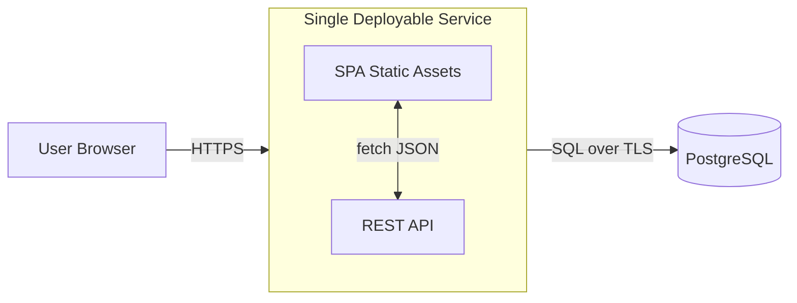

# 1. Title / Version / Status

**Project:** BetterMan  
**Spec Version:** v0.1.0  
**Status:** Draft  
**Last Updated:** 2026-01-03 (EST)

---

# 2. Executive Summary

-   BetterMan is a fast, modern web interface for Linux man pages focused on readability, speed, and navigation.
-   Anonymous, public, internet-facing web app (no accounts, no login) with stable shareable URLs.
-   Supports a defined set of popular Linux distros/versions (Ubuntu LTS, Debian stable, Fedora latest stable, Arch rolling snapshot, Alpine stable) with reproducible ingestion.
-   Provides high-quality rendering (headings, anchors, options tables, examples) versus raw terminal `man`.
-   Includes instant-feel search backed by a server-side index (PostgreSQL Full Text Search) with typo tolerance.
-   Keyboard-first UX: command palette (Cmd/Ctrl+K), global shortcuts, and consistent focus management.
-   Related commands discovery from “SEE ALSO” and cross-references.
-   Safe rendering: no arbitrary HTML injection; XSS-resistant content pipeline.
-   Production-ready v0.1.0 includes observability, rate limiting, backups, and a minimal deploy topology.

**Done (v0.1.0) means:** users can reliably search and read man pages for supported distros/versions with fast load times, stable links, accessible UI, and production-grade security/ops.

---

# 3. Goals

## Product Goals

-   Make man pages easier to read and navigate than terminal output.
-   Make finding commands and flags fast (search-first).
-   Make links shareable and stable across time (versioned distro URLs).

## Engineering Goals (Performance / Reliability)

-   P95 API latency for search under 250 ms at steady state.
-   P95 man page fetch/render under 200 ms API-side (excluding network).
-   Frontend LCP target under 2.5 s on “Fast 3G / mid-tier mobile” for cached shell + first page view under 3.0 s.
-   Zero XSS vulnerabilities from man content rendering.
-   High availability for a single-region v0.1.0 deployment (99.9% monthly).

## Operational Goals

-   Reproducible ingestion: any published dataset can be rebuilt from recorded inputs (container image digests + package manifests + parser version).
-   A single deployable service for web+API, plus managed PostgreSQL; staging and prod isolated.
-   Simple incident response with clear runbooks and metrics/alerts.

---

# 4. Non‑Goals

-   No user accounts, authentication, profiles, favorites, or history in v0.1.0.
-   No SEO-driven requirements (no SSR solely for crawlers; no sitemap/indexing work).
-   No user-generated content (comments, edits, annotations).
-   No offline native apps (desktop/mobile).
-   No full “terminal emulation” or interactive command execution.
-   No guarantee of 100% perfect fidelity to every troff macro edge case; prioritize readability with high fidelity for common pages.
-   No support for non-English locales in v0.1.0 (see content scope).
-   No enterprise features (SAML, private datasets).

---

# 5. Target Users & Primary Use Cases

## Personas

1. **CLI Learner:** learning Linux commands; needs clearer examples and quick lookup.
2. **Working Engineer/SRE:** frequently checks flags and “SYNOPSIS”; needs speed and keyboard navigation.
3. **Support/On-call Engineer:** needs to quickly confirm correct usage across distros.
4. **Educator/Writer:** wants shareable links to authoritative docs for a specific distro version.
5. **Power User:** prefers command palette, deep links to sections, and cross-references.

## Primary User Flows (8–15)

1. Open BetterMan and search for a command (`tar`) from the homepage search.
2. Open a man page directly via URL `/ubuntu/24.04/man/tar/1`.
3. Use Cmd/Ctrl+K to open command palette and jump to `ssh_config(5)`.
4. Switch distro/version for the same page (e.g., Ubuntu 24.04 → Debian 13) and compare.
5. Navigate by man section (1, 5, 8) and browse commands alphabetically.
6. Jump within a page using a generated table of contents (TOC) and anchored headings.
7. Click an option/flag in an “OPTIONS” table to highlight occurrences in the text (optional enhancement; see Open Questions).
8. Click cross-references in “SEE ALSO” to open related pages.
9. Copy a stable link to a specific section anchor (`#options`) and share it.
10. Use keyboard to scroll, jump to next/previous section, and go back.
11. Search for a flag or phrase within a page (“Find in page” integrated or browser-native).
12. Handle missing page: show nearest matches and allow switching distro/version.
13. View examples with syntax highlighting and copy-to-clipboard for code blocks.
14. Use mobile: search, read, and navigate with a sticky header and readable typography.

---

# 6. User Experience (UX) Requirements

## Information Architecture (IA) / Page Layout

**Global layout**

-   Top app bar:
    -   Brand (“BetterMan”) links to home.
    -   Primary search input (expands on focus) and command palette hint (`Ctrl+K`).
    -   Distro/version selector (compact dropdown).
    -   Theme toggle (light/dark/system).
-   Main content area:
    -   **Home:** search focus + quick section navigation + “popular sections” list.
    -   **Search results:** list with name, section, short description, distro badge, and match highlights.
    -   **Man page view:** title header, synopsis, metadata (distro/version, source package if known), TOC, content, related section.

**Man page view structure**

-   Header: `name(section)` + one-line description.
-   Left sidebar (desktop) or collapsible drawer (mobile):
    -   TOC (headings).
    -   Quick nav: “SYNOPSIS”, “DESCRIPTION”, “OPTIONS”, “EXAMPLES”, “SEE ALSO” when available.
-   Main article:
    -   Rendered content with clear typographic hierarchy.
    -   Inline cross-references become links.
    -   Code/examples in preformatted blocks with copy button.

## Navigation Model

-   **Client-side routing** with stable, shareable URLs (no SSR requirement).
-   Back button behavior must be correct for:
    -   search → page → related page → back.
-   Distro/version switching retains current page when available; otherwise routes to a “closest match” state.

## Command Palette (Cmd/Ctrl+K)

**Behavior**

-   Opens a modal overlay with:
    -   Input field (auto-focused).
    -   Result list (keyboard navigable).
-   Default mode: global search across man pages (scoped to current distro/version but can broaden).
-   Supports actions:
    -   “Go to man page…”
    -   “Switch distro/version…”
    -   “Go to section…”
    -   “Toggle theme”
-   Query prefixes:
    -   `>` for actions only (optional in v0.1.0; if omitted, actions appear as top suggestions)
    -   `@` to switch distro/version (optional)
    -   `#` to jump to heading anchors in current page (only when in page view)

## Keyboard Navigation Requirements (global)

-   App must be fully usable with keyboard only.
-   Visible focus indicator must always be present.
-   Focus order must be logical (header → sidebar → content).

### Shortcut List (v0.1.0)

-   **Cmd/Ctrl+K:** Open command palette
-   **Esc:** Close palette / close drawers / dismiss dialogs
-   **/** (slash): Focus search input (when not typing in an input/textarea)
-   **g then h:** Go home (optional; can be omitted if too complex)
-   **g then s:** Go to search results (optional)
-   **Alt+Left:** Back (browser default; ensure no conflicts)
-   **j / k:** Move selection down/up in result lists and TOC (within focused list)
-   **Enter:** Activate selected item
-   **[ / ]:** Previous/next man section in TOC (optional; only if deterministic)
-   **t:** Scroll to top
-   **b:** Toggle sidebar (desktop) / open TOC drawer (mobile)
-   **d:** Toggle theme (light/dark/system cycle)

If optional shortcuts are not implemented, they must not be documented in UI.

## Dark Mode + Responsive Rules

-   Theme modes: Light, Dark, System.
-   Persist user choice in local storage.
-   Contrast ratios must meet WCAG 2.2 AA.
-   Responsive:
    -   < 768px: sidebar becomes a drawer; header remains sticky; content uses larger line-height.
    -   768–1024px: compact sidebar; TOC collapsible.
    -   > 1024px: persistent sidebar and wide reading column with max line width (target 70–90 chars).

## Accessibility Requirements

-   Target **WCAG 2.2 AA**.
-   Focus management:
    -   Command palette traps focus while open; returns focus to trigger element on close.
    -   Route changes set focus to the primary heading (`h1`) for screen readers (without breaking scroll).
-   Reduced motion:
    -   Respect `prefers-reduced-motion`; disable non-essential animations.
-   Semantic structure:
    -   Use proper heading levels and landmarks in the rendered document model.
-   Keyboard:
    -   No keyboard traps outside modals.
-   Color:
    -   Do not rely solely on color to convey meaning (e.g., highlighting matches).

## Empty / Loading / Error States

-   **Loading:** skeleton for title + TOC + paragraphs; do not reflow excessively.
-   **Empty search:** show tips and example queries.
-   **No results:** suggest spelling fixes and offer “search across all supported distros” toggle.
-   **Missing page:** show:
    -   “Not found in this distro/version”
    -   Suggested alternative sections (if name exists in another section)
    -   Suggested alternative distros/versions where it exists
    -   Link to search results for the name

## URL Scheme and Shareable Links

**Stable URL structure (required)**

-   Man page: `/{distro}/{version}/man/{name}/{section}`
    -   Example: `/ubuntu/24.04/man/tar/1`
-   Man page without section (allowed only when unambiguous):
    -   `/{distro}/{version}/man/{name}`
    -   If ambiguous, redirect to a chooser page listing sections.
-   Section browse: `/{distro}/{version}/section/{sectionNumber}`
-   Search: `/{distro}/{version}/search?q=...`
-   Anchor links:
    -   Use `#` fragments for headings/blocks, e.g. `/ubuntu/24.04/man/tar/1#options`

**Canonicalization rules**

-   Normalize `name` to lowercase for routing but preserve display case.
-   Always include exact `version` in shared links (no “latest” in canonical links).
-   Optional convenience alias: `/{distro}/latest/...` may redirect to the current supported version, but must not be presented as canonical.

---

# 7. Core Features (v0.1.0)

## 7.1 Man Page Viewing

### Description

Render man pages into a readable, navigable web document with stable anchors, TOC, and improved typography.

### User Story

As a user, I want to open `man tar` in a browser and quickly understand usage and options without scanning raw terminal formatting.

### Functional Requirements

-   Fetch and display a man page by `(distro, version, name, section, locale=en)`.
-   Show:
    -   Title `name(section)` and one-line description.
    -   TOC generated from headings.
    -   Anchored headings and internal deep links.
    -   Monospace blocks for examples and preformatted text.
-   Cross-references:
    -   Convert `foo(1)` style references to links if present in dataset.
-   Provide a “View source (roff)” toggle (read-only) only if licensing permits; otherwise omit (see Open Questions).

### Edge Cases

-   Page exists in multiple sections (e.g., `printf(1)` and `printf(3)`).
-   Page name includes special characters (`systemd.unit`, `git-commit`).
-   Page contains uncommon roff macros or broken formatting.
-   “NAME” section missing or malformed.
-   Very large pages (e.g., `bash(1)`).

### Acceptance Criteria

-   Given a valid URL for a supported distro/version/page, the UI renders within performance budgets and includes a TOC when headings exist.
-   Headings are linkable via stable anchors and do not change between deploys unless content changes.
-   No raw HTML from man content is injected into the DOM unsanitized (see Section 10).

---

## 7.2 Search (Fast, Relevant)

### Description

Provide fast server-side search across man pages with good ranking for command names, descriptions, and relevant content matches.

### User Story

As an engineer, I want to type “chmod recursive” and immediately find the most relevant pages and sections.

### Functional Requirements

-   Search endpoint supports:
    -   Query string `q`
    -   Scope: `distro`, `version` (default current selection)
    -   Optional: `section` filter, `limit`, `offset`
-   Result includes:
    -   `name`, `section`, short description (from NAME), distro/version
    -   Highlight snippets (plain text) for matches
-   Query features:
    -   Prefix matching for command names (`tar` matches `tar`, `tarfile` if present)
    -   Typo tolerance (e.g., “chrmod” suggests `chmod`)
-   Search must be usable from:
    -   global header search
    -   command palette
    -   dedicated search page with filters

### Edge Cases

-   Empty query or whitespace.
-   Very long query (abuse).
-   Non-ASCII characters (should not crash; may return no results).
-   Query matches too many documents.

### Acceptance Criteria

-   P95 search API latency under 250 ms with warm DB cache at target load (see Section 16).
-   Top 5 results for exact command name queries include that command first (e.g., `ls` returns `ls(1)` as #1 for the scoped distro/version).
-   Typo queries return helpful suggestions or corrected top results.

---

## 7.3 Navigation by Section/Category

### Description

Enable browsing man pages by section (1–9, plus any supported extras) and alphabetical index.

### User Story

As a learner, I want to browse all section 1 “User Commands” and discover commands I didn’t know.

### Functional Requirements

-   Section landing page shows:
    -   Section title (e.g., “1: User Commands”)
    -   Alphabetical grouping (A–Z, 0–9)
    -   Search-within-section
-   Provide consistent section labels across distros:
    -   Use standard man section mapping for display names.
-   Support deep link to section pages.

### Edge Cases

-   Some distros include extra sections (`7`, `n`, `l`, etc.).
-   Pages with non-letter starting characters.
-   Empty section for a distro/version (should be unlikely but must handle).

### Acceptance Criteria

-   Users can navigate from home → section → page without using search.
-   Section listing loads under performance budgets and is paginated if needed.

---

## 7.4 Related Commands

### Description

Show related commands derived from “SEE ALSO” and cross-reference signals.

### User Story

As a user reading `curl(1)`, I want to quickly jump to related tools and configuration docs.

### Functional Requirements

-   Display a “Related” panel on man page view:
    -   Primary: parsed “SEE ALSO” references that resolve to known pages.
    -   Secondary: same-prefix heuristics (e.g., `git-*` pages) limited to avoid noise.
-   Each related item shows `name(section)` + one-line description when available.
-   Related list is deterministic for a given dataset release.

### Edge Cases

-   “SEE ALSO” references pages not in dataset (different package set).
-   References without sections.
-   References to external URLs in content.

### Acceptance Criteria

-   When “SEE ALSO” exists and contains resolvable references, at least those appear in Related.
-   Related links never produce broken navigation; if missing, they route to a missing-page UX with suggestions.

---

## 7.5 Command Palette

### Description

A keyboard-first omnibox to search, jump, and toggle app actions.

### User Story

As a power user, I want to press Ctrl+K and open `systemd.service(5)` without touching the mouse.

### Functional Requirements

-   Opens with Cmd/Ctrl+K.
-   Displays:
    -   search results (man pages)
    -   action results (theme toggle, switch distro/version)
-   Keyboard navigation: Up/Down, Enter to open, Esc to close.
-   Remembers last used mode (optional).

### Edge Cases

-   Palette opened on slow network: show loading state and cached recent results.
-   Query returns no results: show “Search all distros” option.

### Acceptance Criteria

-   Palette opens in < 50 ms UI response (no network required to open).
-   Palette is fully accessible (focus trap, ARIA labeling via React components; no raw HTML).

---

## 7.6 Syntax Highlighting for Examples

### Description

Improve readability of examples and configuration snippets via syntax highlighting and copy support.

### User Story

As a user, I want to copy a `bash` example from a man page and understand it quickly.

### Functional Requirements

-   Detect preformatted blocks and classify as:
    -   shell-like commands (default)
    -   config/INI-like
    -   diff (if patterns match)
    -   unknown → render monospace without highlighting
-   Highlighting must be performed safely without executing any embedded content.
-   Provide “Copy” button per code block:
    -   Copies plain text exactly as displayed (without line numbers).

### Edge Cases

-   Blocks with mixed content and wrapped lines.
-   Very large blocks.
-   Non-UTF8 characters (should be normalized during ingestion).

### Acceptance Criteria

-   At least shell-like examples are highlighted in v0.1.0.
-   Copy always works and produces expected content.

---

## 7.7 Keyboard Navigation Everywhere

### Description

Consistent keyboard interactions across search, TOC, related links, and page content.

### User Story

As a keyboard-only user, I want to navigate search results and TOC without losing context.

### Functional Requirements

-   Search results list:
    -   Arrow keys or j/k to move selection
    -   Enter to open
    -   Esc to return focus to search input
-   TOC:
    -   Keyboard navigable list with Enter to jump
-   Page:
    -   “t” scroll to top
    -   Focus outlines visible
-   Ensure no focus loss on route changes.

### Edge Cases

-   Screen reader virtual cursor interactions with long documents.
-   Modals/drawers stacking (palette + TOC drawer): must define priority and Esc behavior.

### Acceptance Criteria

-   Full “search → open result → use TOC → open related → back” flow is possible without mouse.
-   Meets WCAG 2.2 AA keyboard criteria.

---

# 8. Supported Distros, Versions, and Content Scope

## Definition of “Most Common/Popular” (Operational)

For v0.1.0, “most common/popular” means:

-   Distros that are widely used across **desktop**, **server**, and **container** contexts, and
-   Have **official container images** suitable for reproducible extraction, and
-   Represent both **stable/LTS** and **fast-moving** ecosystems.

## Supported Distros/Versions (v0.1.0)

BetterMan will support the following dataset targets:

1. **Ubuntu 24.04 LTS** (`ubuntu:24.04`)
2. **Ubuntu 22.04 LTS** (`ubuntu:22.04`)
3. **Debian 13 (stable: trixie)** (`debian:13`)
4. **Fedora 43** (`fedora:43`)
5. **Arch Linux (rolling)** via monthly snapshot pinned by container image digest (`archlinux:latest@sha256:...` recorded at ingestion time)
6. **Alpine Linux 3.23** (`alpine:3.23`)

**Justification**

-   Ubuntu LTS covers a large share of servers and cloud images and provides long-lived references.
-   Debian stable is a baseline for many servers and derivatives.
-   Fedora represents a fast-moving mainstream distro with up-to-date tooling.
-   Arch represents rolling-release documentation (often referenced by advanced users).
-   Alpine is extremely common in container environments and differs materially (BusyBox, musl).

## Update Cadence and Keeping Current

-   **Monthly** ingestion run (scheduled) for all supported targets.
-   **Emergency** out-of-band ingestion allowed (security/event-driven).
-   Each ingestion run produces a dataset version identifier:
    -   `dataset_release_id` (UTC timestamp + git SHA of ingestion pipeline + parser version).
-   For Fedora, when a new stable Fedora is released, the supported Fedora version for “latest stable” will be updated within **30 days**:
    -   v0.1.0 supports Fedora 43 explicitly; subsequent minor releases may add Fedora 44 while keeping Fedora 43 for a deprecation window (see retention policy).

## When Distros Disagree (Different Content for Same Command)

-   BetterMan treats pages as **distro-version-specific** documents.
-   UI defaults to a selected distro/version; users can switch to compare.
-   If a user opens `/ubuntu/24.04/man/rsync/1` and then switches to Debian 13:
    -   If Debian has it, load Debian’s version.
    -   If not, show a missing-page state and suggest closest alternatives (including other distros).

## Locale / i18n Stance

-   v0.1.0 is **English-only**.
-   Ingestion uses locale `C.UTF-8` (or closest available) and prefers `en` man content when multiple locales exist.
-   Non-English man pages are out of scope for v0.1.0 (see future roadmap).

---

# 9. Content & Data: Man Pages

## Source of Truth (Reproducible Acquisition)

-   Man content is extracted from official distro container images for each target distro/version.
-   For each target, ingestion records:
    -   Container image reference and resolved digest
    -   Installed package manifest (package name + version)
    -   Environment (locale, architecture)
    -   Ingestion toolchain versions (mandoc version, pipeline version)

## Licensing / Compliance Strategy

-   Many man pages are under GPL, BSD, MIT, or other licenses depending on package.
-   v0.1.0 compliance approach:
    -   Store and display **license metadata** per man page when obtainable (from package metadata and/or embedded license files).
    -   Provide an **Attribution / Licenses** page in the app listing:
        -   distro/version dataset release IDs
        -   packages included (manifest)
        -   license references and notices where required
    -   If a man page license requires including full text, link to the license text and/or include it in the attribution page when mandated.

**Assumption**

-   Redistribution of man pages is permitted under their licenses when proper notices are provided. (See Open Questions for final legal confirmation.)

## Canonical Identity for a Man Page

A man page is uniquely identified by:

-   `name` (string; e.g., `tar`)
-   `section` (string; e.g., `1`, `5`, `8`, `3p`)
-   `distro` (enum; e.g., `ubuntu`)
-   `distro_version` (string; e.g., `24.04`)
-   `locale` (string; v0.1.0 fixed to `en`)
-   Optional: `package_name` and `package_version` (for attribution and provenance)

Canonical ID format (conceptual):

-   `{distro}:{version}:{locale}:{name}({section})`

## Collision Handling

-   Same `name` across sections:
    -   Treated as distinct documents (must include `section` in canonical URL).
-   Same `name(section)` across distros/versions:
    -   Treated as separate documents; UI offers switching.
-   Multiple source files mapping to same `name(section)` within a distro/version (rare):
    -   Choose the one provided by the package with higher priority:
        1. base system packages
        2. non-base packages
    -   Record collision in ingestion report and mark as “resolved by priority”.
    -   Keep the discarded candidates in an internal audit table (not user-facing) for debugging.

## Data Retention / Versioning Policy

-   Keep at least **6 monthly dataset releases** in production (rolling window) OR **180 days**, whichever is larger.
-   For each supported distro/version, keep:
    -   The current dataset release (active)
    -   The previous dataset release (rollback)
-   If storage becomes an issue, delete older full content blobs first while retaining metadata and release audit logs.

---

# 10. Parsing & Rendering Pipeline

## Recommended Parsing Approach and Rationale

**Decision:** Use `mandoc` as the primary renderer to convert roff man pages into a normalized intermediate representation.

-   Ingestion will run `mandoc` to produce a structured-enough output (HTML fragment) and then convert it into a **safe internal document model** (blocks/inlines) used by the UI.
-   Rationale:
    -   `mandoc` is widely used, robust for man/mdoc, and designed for safe rendering of roff.
    -   Producing a deterministic intermediate model allows stable anchors and consistent styling.

**Why this is necessary**

-   A reliable roff parser is non-trivial; delegating to a mature tool reduces correctness and security risk.

**Alternative**

-   `groff -Thtml` (higher variability, more complex output)
-   `man2html` (lower fidelity; more formatting edge cases)

## Ingestion Mechanism

For each supported distro/version target:

1. Start from pinned container image.
2. Install minimal packages required to access man pages (varies by distro):
    - `man-db` or equivalent
    - core `manpages` packages
    - (optional) common base utilities if container is too minimal
3. Enumerate man page source files (typically under `/usr/share/man`).
4. For each page:
    - Extract raw roff source (store hash; optionally store raw content if licensing permits)
    - Render using `mandoc` and capture output
    - Parse into internal document model
    - Extract metadata fields:
        - title, description (NAME), headings, options, examples, see also
        - plain text for search indexing
5. Validate (see below) and upsert into PostgreSQL.

## Validation and Failure Handling

-   Validation levels:
    -   **Hard fail** for:
        -   ingestion cannot record provenance (image digest, dataset release id)
        -   output cannot be sanitized into the safe internal model
    -   **Soft fail** for:
        -   parser cannot extract some structured fields (options table missing)
        -   unusual macro sections
-   Failures are recorded with:
    -   target distro/version
    -   file path
    -   error category
    -   sample excerpt (truncated)
-   Release rule:
    -   If > 2% of pages hard-fail for a target, ingestion fails and does not publish that target’s update.

## Output Schema (Internal Document Model)

**Decision:** Store parsed content as JSON (JSONB) representing a restricted set of nodes.

High-level schema (illustrative, not code):

-   Document:
    -   `title`: string
    -   `name`: string
    -   `section`: string
    -   `description`: string (one-line)
    -   `toc`: list of `{id, title, level}`
    -   `blocks`: array of block nodes

Block node types:

-   `heading`: `{id, level, text}`
-   `paragraph`: `{inlines: [...] }`
-   `list`: `{ordered: bool, items: [blocks...] }`
-   `definition_list`: `{items: [{termInlines, definitionBlocks}] }`
-   `code_block`: `{text, languageHint, id?}`
-   `table`: minimal support for options tables `{headers, rows}`
-   `horizontal_rule`
-   `note` / `warning` (optional mapping from common patterns)

Inline node types:

-   `text`: `{text}`
-   `code`: `{text}`
-   `emphasis`: `{inlines}`
-   `strong`: `{inlines}`
-   `link`: `{href, inlines, linkType: internal|external}`

Derived structured fields:

-   `synopsis`: array of code-like lines
-   `options`: normalized list of `{flags, argument, description, anchorId}`
-   `examples`: list of `{code_block_id, caption?}`
-   `see_also`: list of `{name, section?, resolved_page_id?}`

## Rendering Rules (Model → UI)

-   `heading` → rendered heading with anchor link icon on hover/focus.
-   `definition_list` and `options`:
    -   Prefer rendering `options` in a table-like component for scannability.
-   `code_block`:
    -   Monospace, scrollable horizontally, copy button, syntax highlighting.
-   `link`:
    -   Internal: route to man page.
    -   External: open in new tab with clear indicator (optional); always safe URL scheme.

## XSS-Safe Rendering Strategy (Explicit)

**Decision:** Never render man content via raw HTML insertion in the frontend.

-   All content is converted during ingestion into the restricted document model.
-   Frontend renders nodes using React components that escape text by default.
-   Links:
    -   Allow only `http` and `https` for external links.
    -   Strip/deny `javascript:`, `data:`, and other unsafe schemes.
-   No inline styles, no event handlers, no arbitrary attributes from source.
-   Any unexpected node types or malformed nodes are dropped with an ingestion warning.

## Quality Strategy: Fidelity vs Readability

-   Default priority: **readability** while preserving semantic structure.
-   Metrics:
    -   Parse success rate (% pages with non-empty title + blocks)
    -   Structured extraction rate (options extracted when “OPTIONS” exists)
    -   Anchor stability (hash of heading text mapping)
-   Testing:
    -   Golden tests on a curated set of representative pages across distros (see Section 19).
    -   Visual regression (optional; keep minimal for v0.1.0).

---

# 11. Search & Ranking

## Architecture Decision (Server-side vs Client-side vs Hybrid)

**Decision:** Server-side search using PostgreSQL Full Text Search (FTS), with trigram similarity for typo tolerance.

**Why**

-   Avoids specialized infra (no Elasticsearch/OpenSearch).
-   Keeps dependencies minimal (PostgreSQL already required).
-   Scales well for the dataset size expected in v0.1.0.

**Alternative**

-   Client-side search with a downloaded index (large payload, slower on mobile, harder to update)
-   Dedicated search engine (better relevance at high scale but adds infra complexity)

## Indexing Technology

-   PostgreSQL:
    -   `tsvector` columns for:
        -   command name
        -   one-line description
        -   headings
        -   body text (normalized)
    -   `pg_trgm` index for fuzzy matching on names and short descriptions.

## Ranking Signals and Tie-breakers

Ranking score composed of:

1. Exact match on `name` (highest boost)
2. Prefix match on `name`
3. Match in `NAME` one-line description
4. Match in headings
5. Match in body text
6. Section preference (default order: 1, 8, 5, 7, 3, others; configurable)
7. Distro preference:
    - Prefer currently selected distro/version
    - If “search all distros” is enabled, tie-break by distro family popularity order (Ubuntu, Debian, Fedora, Arch, Alpine) unless user selects otherwise

Tie-breakers:

-   Shorter name first
-   Lower section number first (when numeric)
-   Stable deterministic ordering by `page_id`

## Query Features

-   Prefix: supported for name (`tar` matches `tar`, `tar-split` etc.).
-   Fuzzy:
    -   Use trigram similarity on name/description when FTS score is low.
-   Synonyms:
    -   v0.1.0: minimal. Do not maintain a large synonym dictionary.
    -   Optional: treat hyphen/underscore variants as equivalent during normalization.

## Performance Targets and Caching

-   Targets (API):
    -   Search: P50 < 80 ms, P95 < 250 ms (warm cache)
    -   Page fetch: P50 < 50 ms, P95 < 150 ms
-   Caching:
    -   HTTP caching for GET endpoints with `ETag` and `Cache-Control: public, max-age=300` for immutable dataset release pages.
    -   Longer cache for static assets (1 year with content hashes).
    -   No Redis in v0.1.0; rely on DB + CDN/browser caching.

## Abuse Controls (Rate limiting, Bot Mitigation)

-   Implement basic per-IP rate limiting at the application layer:
    -   Search endpoints stricter than page fetch.
    -   Example policy (tunable):
        -   `/search`: 60 requests/min per IP
        -   `/man/...`: 300 requests/min per IP
-   Block obviously abusive patterns:
    -   Reject extremely long queries (e.g., > 200 chars) with 400.
    -   Reject excessive offsets/limits.
-   Optional (recommended) front-door protection:
    -   Use the PaaS/DNS provider’s basic DDoS protection; avoid introducing dedicated WAF configuration unless needed.

---

# 12. System Architecture

## High-level Architecture Diagram



## Frontend Architecture

-   React + TypeScript SPA
-   Routing:
    -   Client-side router with routes mirroring URL scheme in Section 6
    -   404 fallback served to SPA for deep links
-   Data fetching:
    -   Use a lightweight query/caching library (see below) or minimal custom fetch with in-memory cache.
    -   Must support request cancellation on route changes.
-   Error boundaries:
    -   Global error boundary to render a “Something went wrong” page without white-screen.
-   Caching:
    -   Browser HTTP cache + in-app memoization for recently viewed pages.
-   Performance:
    -   Code splitting by route (search vs page view).
    -   Avoid rendering huge documents with expensive reflows; use efficient components.

## Backend Architecture

-   Single FastAPI service providing:
    -   Read-only public REST endpoints
    -   Internal-only ingestion endpoints or DB-only ingestion (see Section 18)
-   Modules (conceptual):
    -   `api`: routing, request validation, error envelope
    -   `manpages`: retrieval, resolving references, related
    -   `search`: query parsing, ranking, suggestions
    -   `datasets`: distro/version metadata, release IDs
    -   `security`: rate limiting, headers, CSP config
    -   `observability`: logging, metrics, tracing hooks

## Background Jobs / Workers

**Decision:** No always-on background workers in v0.1.0.

-   Ingestion and indexing run via scheduled GitHub Actions (Section 18), not an internal queue.
-   Rationale: reduces moving parts and operational complexity.
-   If later needed, add a minimal cron job runner in the same service.

## Static Asset / CDN Strategy

-   Serve SPA assets from the same service for v0.1.0 simplicity.
-   Enable CDN caching via the PaaS edge if available.
-   All assets must be fingerprinted (content-hash filenames) to allow long-term caching.

## Trade-offs and Debloat Rationale

-   Single service reduces operational overhead but couples API and frontend deploys.
-   PostgreSQL FTS avoids introducing search infrastructure.
-   Monthly ingestion avoids complex streaming updates.

### Libraries/Tools (minimal) with “Why necessary” + alternatives

-   **FastAPI**: Why necessary: fast, typed, production-ready API with minimal boilerplate. Alternative: Flask (less built-in validation) or no backend (client-only; rejected for search and dataset size).
-   **PostgreSQL**: Why necessary: durable storage + FTS + indexing in one system. Alternative: SQLite (insufficient for multi-user production and FTS scale).
-   **mandoc** (ingestion): Why necessary: robust man/mdoc renderer for roff inputs. Alternative: groff/man2html (less consistent).
-   **React + TypeScript**: Why necessary: component model + maintainability for complex rendering and keyboard UX. Alternative: Vue/Svelte (viable but not chosen per defaults).
-   **Syntax highlighting library** (e.g., highlight.js with limited languages): Why necessary: meet “syntax highlighting for examples” requirement. Alternative: Prism (similar trade-offs) or no highlighting (not acceptable).
-   **Error reporting** (e.g., Sentry): Why necessary: production visibility into frontend/backend crashes. Alternative: rely on logs only (slower debugging).

## Rejected Stack Choices (Explicit)

-   **Elasticsearch/OpenSearch**: rejected due to extra infra, ops burden, and cost for v0.1.0; PostgreSQL FTS is sufficient.
-   **Redis**: rejected; caching can be achieved with HTTP caching and Postgres; rate limiting can be basic in-app for v0.1.0.
-   **GraphQL**: rejected; REST endpoints are simpler, cache-friendly, and sufficient.
-   **Microservices**: rejected; unnecessary complexity at current scope.
-   **SSR/Next.js for SEO**: rejected; SEO indexing not required; CSR is simpler and faster to ship. (See SSR decision below.)

---

# 13. API Specification

## Protocol Style

**Decision:** REST + JSON over HTTPS.

Base path:

-   `/api/v1`

## Endpoint List (High-level)

### Distro/Version Metadata

-   `GET /api/v1/datasets`
    -   Returns supported distros/versions and current dataset release ids.

Example response (shape):

```json
{
	"datasets": [
		{
			"distro": "ubuntu",
			"version": "24.04",
			"datasetReleaseId": "2026-01-01T00:00:00Z+abc123",
			"locale": "en"
		}
	]
}
```

### Fetch Man Page

-   `GET /api/v1/man/{distro}/{version}/{name}`
    -   If unambiguous, returns that page; if ambiguous, returns 409 with options.
-   `GET /api/v1/man/{distro}/{version}/{name}/{section}`

Response includes:

-   `page`: metadata
-   `content`: document model JSON
-   `related`: optionally embedded or separate endpoint

Example response (shape):

```json
{
	"page": {
		"id": "uuid-or-int",
		"distro": "ubuntu",
		"version": "24.04",
		"locale": "en",
		"name": "tar",
		"section": "1",
		"title": "tar(1)",
		"description": "an archiving utility",
		"sourcePackage": "tar",
		"sourcePackageVersion": "x.y.z",
		"datasetReleaseId": "..."
	},
	"content": {
		"toc": [{ "id": "synopsis", "title": "SYNOPSIS", "level": 2 }],
		"blocks": [
			{
				"type": "heading",
				"id": "synopsis",
				"level": 2,
				"text": "SYNOPSIS"
			}
		]
	}
}
```

### Related

-   `GET /api/v1/man/{distro}/{version}/{name}/{section}/related`

Example response (shape):

```json
{
	"items": [
		{
			"name": "gzip",
			"section": "1",
			"title": "gzip(1)",
			"description": "compress or expand files"
		}
	]
}
```

### Search

-   `GET /api/v1/search`
    Query params:
-   `q` (required)
-   `distro`, `version` (optional; if omitted, backend uses defaults configured in app)
-   `section` (optional)
-   `limit` (default 20, max 50)
-   `offset` (default 0, max 5000)
-   `allDistros` (optional boolean; if true, search across all supported datasets)

Example response (shape):

```json
{
	"query": "chmod recursive",
	"results": [
		{
			"name": "chmod",
			"section": "1",
			"title": "chmod(1)",
			"description": "change file mode bits",
			"distro": "ubuntu",
			"version": "24.04",
			"highlights": ["... change the mode of each FILE to MODE ..."]
		}
	],
	"suggestions": ["chmod", "chown"]
}
```

### Section Browse

-   `GET /api/v1/sections`
    -   Returns supported sections with labels.
-   `GET /api/v1/section/{distro}/{version}/{section}`
    -   Returns paginated listing.

## Pagination / Filtering / Sorting

-   Pagination: `limit` + `offset` for v0.1.0 simplicity.
-   Sorting:
    -   Search: relevance only.
    -   Section listing: alphabetical by `name`, stable tie-break by `section` and id.

## Standard Error Envelope

All errors return:

```json
{
	"error": {
		"code": "string",
		"message": "string",
		"details": { "optional": "object" }
	}
}
```

Examples:

-   404: `PAGE_NOT_FOUND`
-   409: `AMBIGUOUS_PAGE`
-   429: `RATE_LIMITED`

## Auth Stance (No Accounts)

-   Public endpoints are unauthenticated.
-   Internal ingestion endpoints (if exposed) must require a static bearer token or HMAC signature and be IP-restricted if possible.

## CORS, Rate Limits, Abuse Protection

-   CORS:
    -   Allow same-origin by default.
    -   If a separate domain hosts frontend, allow that specific origin only.
-   Rate limiting:
    -   Enforced on API endpoints (see Section 11).

## API Versioning Strategy

-   Prefix version in path: `/api/v1`.
-   Backwards-incompatible changes require `/api/v2` and parallel support for at least one release cycle (policy decision; v0.1.0 sets the precedent).

---

# 14. Database & Storage Design

## DB Strategy

**Decision:** PostgreSQL as the single durable datastore.

Justification:

-   Stores structured content (JSONB), metadata, and search vectors.
-   Enables fast search without extra systems.
-   Supports strong migrations and backups.

## Entities / Tables (High-level)

### `datasets`

-   `id`
-   `distro` (enum-like text)
-   `version` (text)
-   `locale` (text, v0.1.0 always `en`)
-   `dataset_release_id` (text)
-   `image_ref` (text)
-   `image_digest` (text)
-   `ingested_at` (timestamp)
-   `package_manifest` (JSONB, optional but recommended)
-   Index: unique (`distro`, `version`, `locale`, `dataset_release_id`)

### `man_pages`

Represents a canonical page identity within a dataset (distro/version/locale).

-   `id`
-   `dataset_id` (FK to datasets)
-   `name` (text)
-   `section` (text)
-   `title` (text)
-   `description` (text)
-   `source_path` (text; original man file path)
-   `source_package` (text, nullable)
-   `source_package_version` (text, nullable)
-   `content_sha256` (text; hash of raw roff or normalized content)
-   Timestamps
-   Constraints: unique (`dataset_id`, `name`, `section`)

### `man_page_content`

-   `man_page_id` (PK/FK)
-   `doc` (JSONB) — internal document model
-   `plain_text` (text) — normalized text for search/snippets
-   `synopsis` (text or JSONB)
-   `options` (JSONB) — extracted list
-   `see_also` (JSONB) — extracted refs
-   Optional: `raw_roff` (bytea/text) if licensing allows (see Open Questions)

### `man_page_search`

Options:

-   either store search fields in `man_page_content` with generated columns
-   or a separate table for clarity

Recommended fields:

-   `man_page_id` (PK/FK)
-   `tsv` (tsvector)
-   `name_norm` (text)
-   `desc_norm` (text)

### `man_page_links`

Normalized resolved relationships (for related commands):

-   `from_page_id`
-   `to_page_id`
-   `link_type` (enum: `see_also`, `xref`)
-   Index: (`from_page_id`, `link_type`)

### `licenses`

-   `id`
-   `license_id` (SPDX id when known, else text)
-   `license_name`
-   `license_text` (optional)
-   `source_url` (optional)

### `man_page_license_map`

-   `man_page_id`
-   `license_id`
-   `attribution_text` (optional; includes required notices)

## Index Strategy

-   `man_pages`:
    -   btree on (`dataset_id`, `name`, `section`)
    -   btree on (`dataset_id`, `section`, `name`) for section browse
-   `man_page_search`:
    -   GIN index on `tsv`
    -   GIN or GIST trigram index on `name_norm` and `desc_norm` (requires `pg_trgm`)
-   `man_page_links`:
    -   btree on `from_page_id`
    -   btree on `to_page_id`

## Migration Strategy

-   Use a standard migration tool (e.g., Alembic) with:
    -   forward-only migrations
    -   migrations required for every schema change
-   Migrations applied automatically in staging; in prod, apply as part of deploy with rollback plan.

## Backup / Restore Requirements

-   Automated daily backups of PostgreSQL with 14-day retention minimum.
-   Point-in-time recovery (PITR) preferred if supported by PaaS.
-   Quarterly restore drill (staging restore from prod backup) documented.

---

# 15. Security, Privacy, and Compliance

## Threat Model Summary

-   **XSS:** malicious content embedded in man pages or external links.
-   **Injection:** SQL injection via search queries or parameters.
-   **SSRF:** if ingestion endpoints fetch URLs (avoid in v0.1.0).
-   **Supply chain:** compromised dependencies, compromised container images.
-   **Scraping/abuse:** high-volume requests, search endpoint abuse.
-   **Data integrity:** tampering with dataset releases.

## Mitigations

-   XSS:
    -   Safe document model rendering (no raw HTML injection).
    -   Strict URL sanitization for links.
    -   CSP headers (script-src self; disallow inline scripts; object-src none).
-   Injection:
    -   Parameterized queries only.
    -   Strict input validation for `name`, `section`, `limit`, `offset`.
-   SSRF:
    -   In v0.1.0 ingestion runs offline in CI; backend does not fetch external content.
-   Supply chain:
    -   Pin key dependencies.
    -   Enable dependency scanning (Section 19).
    -   Ingestion records container digests; only use official images.
-   Abuse:
    -   Rate limiting (Section 11).
    -   Cache aggressively.
-   Integrity:
    -   Dataset release IDs and digests stored; ingestion requires signed CI secrets.

## Secrets Management

-   Store secrets in PaaS secret manager:
    -   DB URL
    -   error reporting DSN
    -   ingestion token (if used)
-   Rotate ingestion token quarterly.

## Privacy Stance

-   No accounts.
-   No collection of PII beyond standard server logs (IP addresses) required for security/operations.

## Logging Redaction and Retention

-   Do not log full query strings at info level; store hashed or truncated query for metrics.
-   Retention:
    -   Application logs: 14 days (minimum), with longer retention only if necessary for security.
    -   Error traces: 30 days.

## License Compliance for Man Pages

-   Provide a `/licenses` UI route:
    -   Distro/version dataset release details
    -   package manifest
    -   license notices
-   Maintain an internal compliance checklist per dataset target.

---

# 16. Reliability, Performance, and Scalability

## SLOs / SLIs

-   Availability: **99.9%** monthly for web and API.
-   Latency SLIs:
    -   `/api/v1/search`: P95 < 250 ms
    -   `/api/v1/man/...`: P95 < 150 ms
-   Error rate: < 0.5% 5xx over 5-minute windows (excluding deploy windows).

## Performance Budgets

-   Frontend:
    -   Initial JS bundle (home route): <= 250 KB gz (target; enforce via CI budgets)
    -   Route-based code splitting for man page renderer and highlighting
-   Core Web Vitals (guidance; not SEO-driven but user experience):
    -   LCP < 2.5 s (repeat visits)
    -   INP reasonable (avoid heavy main-thread work on render)

## Caching Layers

-   Browser: ETag and max-age for stable content.
-   CDN/Edge: cache GET responses where safe.
-   API: avoid in-memory caches that cause correctness issues; minimal memoization allowed.
-   DB: rely on Postgres caches; keep indexes optimized.

## Load Assumptions and Scaling Plan

Assumptions for v0.1.0:

-   50–200 concurrent users typical
-   Bursts: up to 1,000 requests/min during spikes

Scaling:

-   Vertical scaling first (bigger app instance, bigger Postgres).
-   Horizontal scaling for web service if needed (stateless).
-   Rate limiting in-app may need adjustment or front-door enforcement if multi-instance.

## Graceful Degradation

-   If search is slow/unavailable:
    -   show partial results or “search temporarily unavailable” with retry.
-   If page fetch fails:
    -   show cached page in client (if available) and allow retry.
-   If a dataset target is missing:
    -   UI indicates unavailable and suggests supported alternatives.

---

# 17. Observability & Operations

## Metrics / Logs / Traces

-   Metrics (minimum):
    -   request count by route/status
    -   latency histograms by route
    -   rate limit rejections
    -   DB query latency (coarse)
-   Logs:
    -   structured logs with request id
    -   error logs include dataset identifiers when relevant
-   Tracing:
    -   Optional in v0.1.0; do not mandate full distributed tracing since single service. If enabled, use OpenTelemetry minimal setup.

## Dashboards (v0.1.0)

-   API Overview:
    -   RPS, error rate, P50/P95 latency for search and page endpoints
-   DB Health:
    -   connections, slow queries, CPU
-   Abuse:
    -   429 counts, top IPs (aggregated), search query rate

## Alerting Thresholds

-   Availability: 5xx > 2% for 10 minutes → page.
-   Latency: `/search` P95 > 500 ms for 10 minutes → page.
-   DB: connection saturation > 80% for 10 minutes → page.
-   Ingestion: scheduled ingestion fails twice consecutively → ticket.

## Runbooks (Top 5 Incidents)

1. **Search latency spike**
    - Check DB CPU/IO, active queries, index bloat
    - Reduce search limit temporarily via config
    - Enable stricter rate limiting
    - Investigate slow query plan; add/adjust indexes
2. **Man page fetch returning 500**
    - Inspect logs for content decode/parsing issue
    - Identify affected dataset release and page ids
    - Roll back to previous dataset release (if data corruption)
3. **DB connection exhaustion**
    - Check connection pool config
    - Scale DB instance or reduce pool size
    - Verify no connection leaks
4. **Abuse / scraping**
    - Increase rate limiting
    - Add temporary IP blocks
    - If available, enable PaaS-level throttling
5. **Bad ingestion release published**
    - Mark dataset release as inactive
    - Roll back to prior dataset release
    - Re-run ingestion with fix; verify failure thresholds before republishing

---

# 18. CI/CD & Environments

## Environments

-   **dev:** local developer environment with local Postgres
-   **staging:** production-like deployment, separate DB, used for validation
-   **prod:** public deployment

Staging and prod must be isolated:

-   separate DB instances
-   separate secrets
-   separate dataset releases (publish to staging first)

## GitHub Actions Workflows (Responsibilities)

### `ci.yml` (lint/test/build)

-   Install dependencies
-   Run type checks and linting
-   Run unit + integration tests
-   Build frontend assets (production build)
-   Build backend (container build or artifact)
-   Enforce bundle size budget checks

### `deploy.yml` (deploy/promote/rollback)

-   Deploy to staging on merge to main
-   Run smoke tests against staging
-   Manual approval step to promote to prod
-   Rollback:
    -   redeploy previous artifact
    -   optionally flip dataset release pointer to previous release

### `update-docs.yml` (ingest/parse/validate/index/publish)

-   Scheduled monthly + manual dispatch
-   For each supported target:
    -   resolve container image digest
    -   extract man sources
    -   run mandoc conversion + model conversion
    -   validate success rate thresholds
    -   upsert into staging DB first
-   Publish step:
    -   after staging verification, upsert into prod DB (or promote by copying dataset release id pointer)

**Security note**

-   If GitHub Actions writes directly to prod DB, use a restricted DB role and rotate secrets. Prefer a promotion model via staging verification.

## Branching / Releases / Tags / Rollback

-   Trunk-based development:
    -   `main` is always releasable
    -   short-lived feature branches
-   Release tags:
    -   `v0.1.0` tag upon launch
-   Rollback:
    -   redeploy previous version
    -   dataset rollback supported by storing previous dataset release and a “current release” pointer per dataset

## Infrastructure-as-Code (Minimal stance)

-   v0.1.0: minimal IaC acceptable:
    -   Document environment variables and required resources
    -   Optionally include a simple Terraform template later; not required for launch

---

# 19. Testing Strategy

## Unit Tests

-   Parsing/model conversion utilities (ingestion pipeline)
-   Search query normalization and ranking logic
-   Link resolution rules

## Integration Tests

-   API endpoints with a seeded Postgres dataset
-   Search correctness (name exact match, prefix, fuzzy)
-   Man page retrieval and ambiguity behavior

## E2E Tests

-   Core flows in a headless browser:
    -   home search → results → page view
    -   command palette open → select result
    -   distro/version switch
    -   missing page flow

## Contract Tests

-   Frontend ↔ API schema compatibility:
    -   ensure required fields exist and types are stable for v0.1.0
    -   snapshot test JSON shapes

## Golden Tests (Parsing/Rendering Fidelity)

-   Curate a representative suite of pages across distros:
    -   small/simple (e.g., `ls(1)`)
    -   large (`bash(1)`)
    -   mdoc-heavy (`ssh_config(5)`)
    -   options-heavy (`curl(1)`)
-   For each:
    -   compare extracted fields (title/description/TOC count)
    -   compare stable anchors
    -   compare rendered plaintext output snapshots

## Performance Tests

-   Search load test:
    -   ensure P95 < 250 ms at target concurrency
-   Page fetch test:
    -   ensure no N+1 queries for related links

## Accessibility Tests

-   Automated checks (axe or equivalent) on key pages
-   Manual keyboard-only testing checklist for each release

## Security Testing Basics

-   Dependency scanning (SCA)
-   SAST for backend and frontend
-   CSP validation in staging
-   Fuzz testing on search query input normalization (lightweight)

---

# 20. Analytics & Feedback (Optional, privacy-respecting)

**Decision (v0.1.0):** Minimal analytics, opt-out by default where feasible.

-   Collect only aggregate, anonymous metrics:
    -   page views by route template (not full URL with query)
    -   search event count (without raw query text; store query length and whether results found)
    -   performance timing (LCP buckets)
-   Sampling: 10% of sessions max.
-   Retention: 30 days.
-   Opt-out:
    -   Provide a toggle “Anonymous analytics” default OFF (strict privacy stance), stored locally.

If analytics are deemed unnecessary for v0.1.0, ship with **none** and rely on server metrics only (Open Question).

---

# 21. Milestones & Delivery Plan

## Phased Plan (v0.1.0)

1. **Week 1–2: Foundations**
    - Repo scaffold, CI, environments, basic API skeleton, DB schema v1
    - Basic SPA routing + layout + theme
2. **Week 3–4: Ingestion MVP**
    - Container-based extraction for Ubuntu 24.04 and Debian 13
    - Parse to internal document model
    - Render man pages end-to-end
3. **Week 5: Search MVP**
    - PostgreSQL FTS + ranking
    - Search UI + results page
4. **Week 6: Navigation + Related**
    - Section browse pages
    - SEE ALSO parsing + related panel
5. **Week 7: Polish + Accessibility + Performance**
    - Command palette
    - Syntax highlighting + copy
    - Keyboard nav and WCAG fixes
6. **Week 8: Production hardening**
    - Rate limiting, CSP, error reporting, dashboards, runbooks
    - Staging soak + load tests + rollback drills
    - Cut `v0.1.0` tag and launch

## Definition of Done (Launch Checklist)

-   [ ] Supported distros/versions ingested and visible in UI
-   [ ] Stable URLs and anchor links work and are shareable
-   [ ] Search meets latency targets and relevance acceptance criteria
-   [ ] No `dangerouslySetInnerHTML` (or equivalent raw HTML injection) for man content
-   [ ] CSP enabled and verified in staging
-   [ ] Rate limiting enabled and tuned
-   [ ] Backups enabled and restore validated
-   [ ] Monitoring dashboards and alerts configured
-   [ ] Accessibility: WCAG 2.2 AA baseline checks pass; keyboard-only flows validated
-   [ ] Incident runbooks written and reviewed
-   [ ] Licenses/attribution page complete for shipped datasets

---

# 22. Risks & Mitigations

1. **Licensing ambiguity for redistribution**
    - Mitigation: store package manifests + license metadata; provide attribution UI; legal review before launch; omit raw roff download if uncertain.
2. **Parsing fidelity issues / broken pages**
    - Mitigation: golden test suite; ingestion failure thresholds; allow fallback rendering as plain text for specific pages (feature-flagged).
3. **Search quality dissatisfaction**
    - Mitigation: boost exact name matches; add trigram fallback; collect anonymous “no results” counts (if analytics enabled).
4. **Abuse/scraping leading to cost spikes**
    - Mitigation: aggressive caching; rate limiting; optional upstream protection; cap limits/offsets.
5. **Dataset drift and reproducibility**
    - Mitigation: record container digests and manifests; version dataset releases; keep rollback releases.

---

# 23. Open Questions

Prioritized:

1. **Licensing policy detail:** Are we allowed (and do we want) to expose “View raw roff source” publicly for all pages? If not, restrict to rendered content only.
2. **Ingestion write path:** Should GitHub Actions write directly to prod DB, or should we require a gated “promote from staging” step that copies dataset releases?
3. **Analytics stance:** Ship with no client analytics (server metrics only) vs minimal opt-in anonymous analytics?
4. **Option highlighting feature:** Do we want interactive “click an option to highlight occurrences” in v0.1.0, or defer?
5. **Arch ingestion source:** Is using `archlinux:latest` pinned by digest sufficient, or do we require Arch Linux Archive snapshots for stronger reproducibility?
6. **Supported sections:** Do we limit to sections 1–9 for v0.1.0, or include additional sections like `3p`, `n`, etc. where present?
7. **External link handling:** Should external links be allowed at all (some man pages include URLs), or should we strip them and show plain text?

---

# 24. Appendix

## Glossary

-   **Man page:** Unix manual page document, typically roff-based.
-   **roff/troff:** Typesetting language family used for man pages.
-   **mandoc:** A tool that parses and formats man/mdoc documents.
-   **Dataset release:** A versioned snapshot of ingested man content per distro/version.
-   **FTS:** Full Text Search.
-   **TOC:** Table of Contents.

## Referenced Schemas (High level)

-   Internal Document Model: Section 10 “Output Schema”
-   API Error Envelope: Section 13
-   Canonical identity: Section 9

## Keyboard Shortcuts Table (v0.1.0)

| Shortcut   | Context             | Action                      |
| ---------- | ------------------- | --------------------------- |
| Cmd/Ctrl+K | Global              | Open command palette        |
| Esc        | Global/Modal        | Close modal/drawer, dismiss |
| /          | Global              | Focus search input          |
| j / k      | Lists (results/TOC) | Move selection down/up      |
| Enter      | Lists               | Activate selection          |
| t          | Page view           | Scroll to top               |
| b          | Page view           | Toggle TOC sidebar/drawer   |
| d          | Global              | Toggle theme (cycle)        |
| Alt+Left   | Browser             | Back                        |

---

## Required Decisions Summary (for audit)

-   Search architecture: **Server-side** via PostgreSQL FTS + trigram.
-   Ingestion/update pipeline: **Monthly**, reproducible via pinned container digests + manifests; validated with failure thresholds.
-   Multi-distro/version handling: **Distro-version-specific identity**; collisions resolved by explicit section and dataset scoping.
-   Safe rendering: **Restricted document model**, no raw HTML injection; strict link sanitization.
-   Deployment topology: **Single service** (web+API) + **managed PostgreSQL**, with staging and prod separation.
-   SSR usage: **No SSR** in v0.1.0; CSR SPA with stable URLs and server fallback routing.
